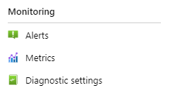
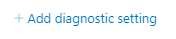
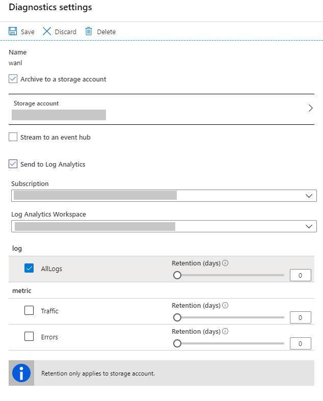
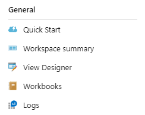
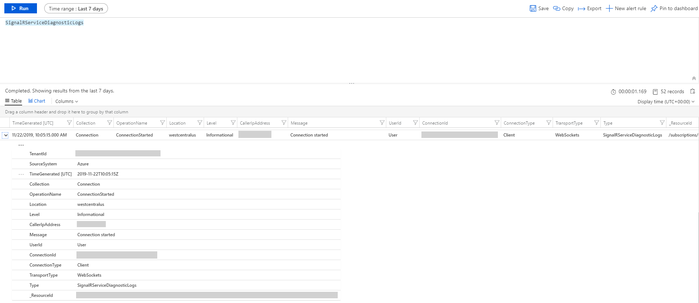

- [Prerequisites](#prerequisites)
- [Set up diagnostic logs for an Azure SignalR Service](#set-up-diagnostic-logs-for-an-azure-signalr-service)
  - [Enable diagnostic logs](#enable-diagnostic-logs)
  - [Diagnostic logs categories](#diagnostic-logs-categories)
  - [Archive to a storage account](#archive-to-a-storage-account)
    - [Archive logs schema for Log Analytics](#archive-logs-schema-for-log-analytics)
  - [Trouble Shooting With Diagnostic Logs](#trouble-shooting-with-diagnostic-logs)
  - [Unexpected Connection Dropping](#unexpected-connection-dropping)
  - [Unexpected Connection Growing](#unexpected-connection-growing)
  
# Prerequisites
To enable diagnostic logs, you'll need somewhere to store your log data. This tutorial uses Azure Storage and Log Analytics.

* [Azure storage](https://docs.microsoft.com/en-us/azure/azure-monitor/platform/resource-logs-collect-storage) - Retains diagnostic logs for policy audit, static analysis, or backup.
* [Log Analytics](https://docs.microsoft.com/en-us/azure/azure-monitor/platform/resource-logs-collect-workspace) - A flexible log search and analytics tool that allows for analysis of raw logs generated by an Azure resource.

# Set up diagnostic logs for an Azure SignalR Service

You can view diagnostic logs for Azure SignalR Service. These logs provide richer view of connectivity to your Azure SignalR Service instance. The diagnostic logs provide detailed information of every connection. For example, basic information (user ID, connection ID and transport type, etc.) and event information (connect, disconnect and abort event, etc.) of the connection. Diagnostic logs can be used for issue identification, connection tracking and analysis.

## Enable diagnostic logs

Diagnostic logs are disabled by default. To enable diagnostic logs, follow these steps:

1.	In the [Azure portal](https://portal.azure.com), under **Monitoring**, click **Diagnostic settings**.

    

1.	Then click **Add diagnostic setting**.

	

1.	Set the archive target that you want. Currently, we support **Archive to a storage account** and **Send to Log Analytics**.

1. Select the logs you want to archive.

	


1.	Save the new diagnostics settings.

New settings take effect in about 10 minutes. After that, logs appear in the configured archival target, in the **Diagnostics logs** pane.

For more information about configuring diagnostics, see the [overview of Azure diagnostic logs](../azure-monitor/platform/resource-logs-overview.md).

## Diagnostic logs categories

Azure SignalR Service captures diagnostic logs in one category:

* **All Logs**: Track connections that connect to Azure SignalR Service. The logs Provide infomation about the connect/disconnect, authentication and throttling. For more information, see the next section.

## Archive to a storage account

Logs are stored in the storage account that configured in **Diagnostics logs** pane. A container named `insights-logs-alllogs` is created automatically to store diagnostic logs. Inside the container, logs are stored in the file `resourceId=/SUBSCRIPTIONS/XXXXXXXX-XXXX-XXXX-XXXX-XXXXXXXXXXXX/RESOURCEGROUPS/XXXX/PROVIDERS/MICROSOFT.SIGNALRSERVICE/SIGNALR/XXX/y=YYYY/m=MM/d=DD/h=HH/m=00/PT1H.json`. Basically, the path is combined by `resource ID` and `Date Time`. The log files are splitted by `hour`. Therefore, the minutes always be `m=00`.

All logs are stored in JavaScript Object Notation (JSON) format. Each entry has string fields that use the format described in the following sections.

Archive log JSON strings include elements listed in the following tables:

Name | Description
------- | -------
time | Log event time
level | Log event level
resourceId | Resource ID of your Azure SignalR Service
location | Location of your Azure SignalR Service
category | Catagory of the log event
operationName | Operation name of the event
callerIpAddress | IP address of your server/client
properties | Detailed properties related to this log event. For more detail, see [`Properties Table`](#properties-table)

<a href="properties-table"></a>
**Properties Table**

Name | Description
------- | -------
type | Collection of the log event. Currently, we provide information about connectivity to the Azure SignalR Service. Only `ConnectivityLogs` collection is available
collection | Type of the log event. Allowed values are: `Connection`, `Authorization` and `Throttling`
connectionId | Identity of the connection
transportType | Transport type of the connection. Allowed values are: `Websockets` \| `ServerSentEvents` \| `LongPolling`
connectionType | Type of the connection. Allowed values are: `Server` \| `Client`. `Server`: connection from server side; `Client`: connection from client side
userId | Identity of the user
message | Detailed message of log event

The following code is an example of an archive log JSON string:

```json
{
    "properties": {
        "message": "Entered Serverless mode.",
        "type": "ConnectivityLogs",
        "collection": "Connection",
        "connectionId": "xxxxxxxxxxxxxxxxxxxxxxxxxxxxxxx",
        "userId": "User",
        "transportType": "WebSockets",
        "connectionType": "Client"
    },
    "operationName": "ServerlessModeEntered",
    "category": "AllLogs",
    "level": "Informational",
    "callerIpAddress": "xxx.xxx.xxx.xxx",
    "time": "2019-01-01T00:00:00Z",
    "resourceId": "/SUBSCRIPTIONS/XXXXXXXX-XXXX-XXXX-XXXX-XXXXXXXXXXXX/RESOURCEGROUPS/XXXX/PROVIDERS/MICROSOFT.SIGNALRSERVICE/SIGNALR/XXX",
    "location": "xxxx"
}
```

### Archive logs schema for Log Analytics

To view diagnostic logs, follow these steps:

1. Click `Logs` in your target log analytics.

    

1. Enter `SignalRServiceDiagnosticLogs` and select time range to query diagnostic logs. For advanced query, please see [Get started with Log Analytics in Azure Monitor](https://docs.microsoft.com/en-us/azure/azure-monitor/log-query/get-started-portal)

    
 
Archive log columns include elements listed in the following table:

Name | Description
------- | ------- 
TimeGenerated | Log event time
Collection | Type of the log event. Allowed values are: `Connection`, `Authorization` and `Throttling`
OperationName | Operation name of the event
Location | Location of your Azure SignalR Service
Level | Log event level
CallerIpAddress | IP address of your server/client
Message | Detailed message of log event
UserId | Identity of the user
ConnectionId | Identity of the connection
ConnectionType | Type of the connection. Allowed values are: `Server` \| `Client`. `Server`: connection from server side; `Client`: connection from client side
TransportType | Transport type of the connection. Allowed values are: `Websockets` \| `ServerSentEvents` \| `LongPolling`

## Trouble Shooting With Diagnostic Logs

To trouble shoot for Azure SignalR Service, you can enable server/client side logs to capture failures. At present, Azure SiganlR Service exposes diagnostic logs, you can also enable logs for service side.

When encountering connection unexpected growing or dropping situation, you can take advantage of diagnostic logs to trouble shoot.

Typical issues are often about connections's unexpected quantity changes. See the next sections about how to trouble shoot.

## Unexpected Connection Dropping

If you encounter unexpected connections drop, firstly enable logs in service, server and client sides.

If a connection disconnects, the diagnostic logs will record this disconnecting event, you will see `ConnectionAborted` or `ConnectionEnded` in `operationName`.

The difference between `ConnectionAborted` and `ConnectionEnded` is that `ConnectionEnded` is a expected disconnecting which is triggered by client or server side. While the `ConnectionAborted` is usually an unexpected connection dropping event, and aborting reason will be provided in `message`.

The abort reasons are listed in the following table:

Reason | Description
------- | ------- 
Connection count reaches limit | Connection count reaches limit of your current price tier. Consider scale up service unit
Application server closed the connection | App server triggers the abortion. It can be considered as an expected abortion
Connection ping timeout | Usually it is caused by network issue. Consider check your app server's availability from the internet
Service reloading, please reconnect | Azure SignalR Service is reloading. Azure SignalR support auto-reconnect, you can wait until reconnected or manually reconnect to Azure SignalR Service
Internal server transient error | Transient error occurs in Azure SignalR Service, should be auto-recovered
Server connection dropped | Server connection drops with unknown error

## Unexpected Connection Growing

To trouble shoot about unexoected connection growing, the first thing you need to do is filter out the extra connections. You can add unique test user ID to your test client connection. Then verify it in with diagnostic logs, you see more than one client connections have the same test user ID, then it is likely the client side create and establish more connections than expectation. Check your client side. 