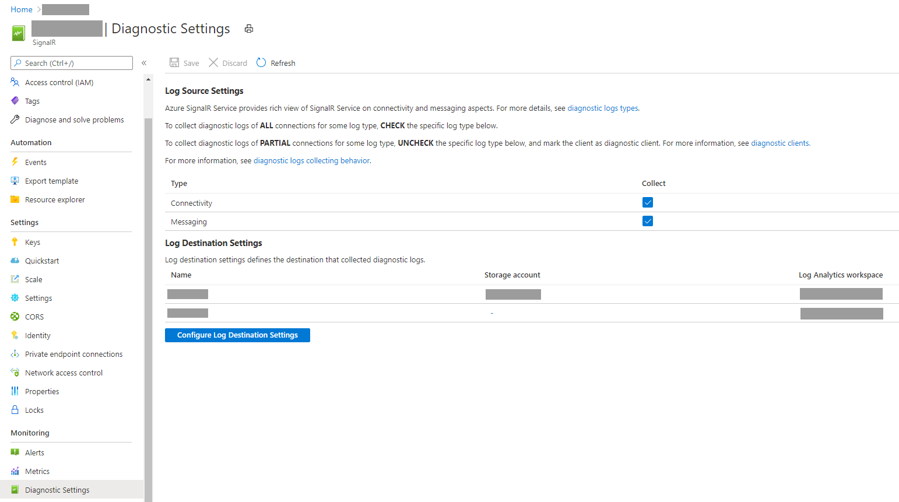
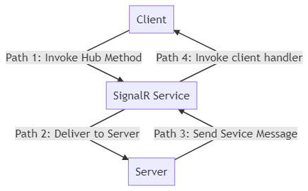

# Diagnostic Logs for Azure SignalR Service <!-- omit in toc --> 

## Contents <!-- omit in toc -->
- [Prerequisites](#prerequisites)
- [Set up diagnostic logs for an Azure SignalR Service](#set-up-diagnostic-logs-for-an-azure-signalr-service)
  - [Enable diagnostic logs](#enable-diagnostic-logs)
  - [Diagnostic logs types](#diagnostic-logs-types)
    - [Connectivity Logs](#connectivity-logs)
    - [Messaging Logs](#messaging-logs)
  - [Diagnostic logs collecting behaviors](#diagnostic-logs-collecting-behaviors)
    - [Collect all](#collect-all)
      - [Configuration guide](#configuration-guide)
    - [Collect partially](#collect-partially)
      - [Diagnostic client](#diagnostic-client)
      - [Configuration guide](#configuration-guide-1)
  - [Archive to a storage account](#archive-to-a-storage-account)
  - [Archive logs schema for Log Analytics](#archive-logs-schema-for-log-analytics)
  - [Troubleshooting with diagnostic logs](#troubleshooting-with-diagnostic-logs)
    - [Connection related issues](#connection-related-issues)
      - [Unexpected connection number changes](#unexpected-connection-number-changes)
        - [Unexpected connection dropping](#unexpected-connection-dropping)
        - [Unexpected connection growing](#unexpected-connection-growing)
      - [Authorization failure](#authorization-failure)
      - [Throttling](#throttling)
    - [Message related issues](#message-related-issues)
      - [Message loss](#message-loss)
  - [Get help](#get-help)
  
## Prerequisites
To enable diagnostic logs, you'll need somewhere to store your log data. This tutorial uses Azure Storage and Log Analytics.

* [Azure storage](https://docs.microsoft.com/en-us/azure/azure-monitor/platform/resource-logs-collect-storage) - Retains diagnostic logs for policy audit, static analysis, or backup.
* [Log Analytics](https://docs.microsoft.com/en-us/azure/azure-monitor/platform/resource-logs-collect-workspace) - A flexible log search and analytics tool that allows for analysis of raw logs generated by an Azure resource.

## Set up diagnostic logs for an Azure SignalR Service

You can view diagnostic logs for Azure SignalR Service. These logs provide richer view of connectivity and messaging information to your Azure SignalR Service instance. The diagnostic logs provide detailed information for SignalR hub connections and SignalR hub messages received and sent via SignalR service. For example, basic information (user ID, connection ID and transport type, etc.) and event information (connect, disconnect and abort event, etc.) of the connection, tracing ID and type of the message. Diagnostic logs can be used for issue identification, connection tracking, message tracing and analysis.

### Enable diagnostic logs

Diagnostic logs are disabled by default. To enable diagnostic logs, follow these steps:

1.	In the [Azure portal](https://portal.azure.com), under **Monitoring**, click **Diagnostic settings**.

    

1.	Then you will get a full view of the diagnostic settings.

	

1. Configure the log source settings.
   1. In **Log Source Settings** section, a table shows collecting behaviors for each log type. 
   1. Check the the specific log type you want to collect for all connections. Otherwise the the log will be collected only for [diagnostic clients](#diagnostic-client).
1. Configure the log destination settings. 
   1. In **Log Destination Settings** section, a table of diagnostic settings display the existing diagnostic settings. You can click the link in the table to get access to the log destination to view the collected diagnostic logs.
   1. In this section, click the button **Configure Log Destination Settings** to add, update, or delete diagnostic settings.
   1. Click **Add diagnostic setting** to add a new diagnostic setting, or click **Edit** to moidify an existing diagnostic setting.
   1.	Set the archive target that you want. Currently, SignalR service supports **Archive to a storage account** and **Send to Log Analytics**.
   1. Select the logs you want to archive. Only `AllLogs` is available for diagnostic log. It only controls whether you want to archive the logs. To configure which log types needs to be generated in SignalR service, configure in **Log Source Settings** section.
	
   1.	Save the new diagnostics setting. The new setting takes effect in about 10 minutes. After that, logs will be sent to configured archival target. For more information about configuring log destination settings, see the [overview of Azure diagnostic logs](../azure-monitor/platform/resource-logs-overview.md).

### Diagnostic logs types

Azure SignalR supports 2 types of logs: connectivity log and messaging log.

#### Connectivity Logs

Connectivity logs provide detailed information for SignalR hub connections. For example, basic information (user ID, connection ID and transport type, etc.) and event information (connect, disconnect and abort event, etc.). Therefore, connectivity log is helpful to troubleshoot connection related issues. For typical connection related troubleshooting guide, see [connection related issue](#connection-related-issues). 

#### Messaging Logs

Messaging logs provide tracing information for the SignalR hub messages received and sent via SignalR service. For example, tracing ID and message type of the message. The tracing ID and message type is also logged in app server. Typically the message is recorded when it arrives at or leaves from service or server. Therefore messaging logs are helpful for troubleshooting message related issues. For typical message related troubleshooting guide, see [message related issues](#message-related-issues)

> This type of logs is generated for every messages, if the messages are sent frequently, messaging logs might impact the performance of SignalR service. However, you can choose different collecting behaviors to minimize the performance impact. See [diagnostic logs collecting behaviors](#Diagnostic-logs-collecting-behaviors) below.

### Diagnostic logs collecting behaviors

There are two typical scenarios on using diagnostic logs, especially for messaging logs. 

Someone may care about the quality of each message. For example, they are sensitive on whether the message get sent/received sussessfully, or they want to record every message that is delievered via SignalR service.

In the mean time, others may care about the performance. They are sensitive on the latency of the message, and sometimes they need to track the message in a few connections instead of all the connections for some reason.

Therefore, SignalR service provides two kinds of collecting behaviors
* **collect all**: collect logs in all connections 
* **collect partially**: collect logs in some specific connections

> To distinguish the connections between those collect logs and those don't collect logs, SignalR service will treat some client as diagnotic client based on the diagnostic client configurations of server and client, in which the diagnostic logs always get collected, while the others don't. For more details, see [collect partially section](#collect-partially). 

#### Collect all

Diagnostic logs are collected by all the connections. Take messaging logs for example. When this behavior is enabled, SignalR service will send a notification to server to start generating tracing ID for each message. The tracing ID will be carried in the message to the service, the service will also log the message with tracing ID.

> Note that to ensure the performance of SignalR service, SignalR service doesn't await and parse the whole message sent from client, therefore, the client messages isn't get logged. But if the client is marked as a diagnostic client, then client message will get logged in SignalR service.

##### Configuration guide

To enable this behavior, check the checkbox in the *Types* section in the *Log Source Settings*.

This behavior doesn't require you to update server side configurations. This configuration changing will always be sent to server automatically.

#### Collect partially

Diagnostic logs are **only** collected by [diagnostic clients](#diagnostic-client). All messages get logged inlcuding client messages in the diagnostic clients.

> The limit of the diagnostic clients' number is 100.

##### Diagnostic client

Diagnostic client is a logical concept, any client can be a diagnostic client. The server controls which client can be a diagnostic client. Once a client is marked as a diagnostic client, all diagnostic logs will be enabled in this client. To set a client be a diagnostic client, see the [configuration guide](#configuration-guide-1) below.

##### Configuration guide

To enable this behavior, you need to configure service, server, client side.

###### Service side <!-- omit in toc -->

To enable this behavior, uncheck the checkbox for a specific log type in the *Types* section in the *Log Source Settings*. 

###### Server side <!-- omit in toc -->

Also setup `ServiceOptions.DiagnosticClientFilter` to define a filter of diagnostic clients based on the http context comes from clients. For example, make client with hub URL `<HUB_URL>?diag=yes`, then setup `ServiceOptions.DiagnosticClientFilter` to filter the diagnostic client. If it returns `true`, the client will be marked as diagnostic client; otherwise, it keeps as normal client. The `ServiceOptions.DiagnosticClientFilter` can be set in your startup class like this:

```
// sample: mark a client as diagnostic client when it has query string "?diag=yes" in hub URL
public IServiceProvider ConfigureServices(IServiceCollection services)
{
    services.AddMvc();
    services
        .AddSignalR()
        .AddAzureSignalR(o =>
        {
            o.ConnectionString = "<YOUR_ASRS_CONNECTION_STRING>";
            o.DiagnosticClientFilter = context => context.Request.Query["user"] == "yes";
        });

    return services.BuildServiceProvider();
}
```
###### Client side <!-- omit in toc -->

Mark the client as diagnostic client by configuring the http context. For example, the client is marked as diagnostic client by adding the query string `diag=yes`.

```
var connection = new HubConnectionBuilder()
    .WithUrl("<HUB_URL>?diag=yes")
    .Build();
```

### Archive to a storage account

Logs are stored in the storage account that configured in **Diagnostics logs** pane. A container named `insights-logs-alllogs` is created automatically to store diagnostic logs. Inside the container, logs are stored in the file `resourceId=/SUBSCRIPTIONS/XXXXXXXX-XXXX-XXXX-XXXX-XXXXXXXXXXXX/RESOURCEGROUPS/XXXX/PROVIDERS/MICROSOFT.SIGNALRSERVICE/SIGNALR/XXX/y=YYYY/m=MM/d=DD/h=HH/m=00/PT1H.json`. Basically, the path is combined by `resource ID` and `Date Time`. The log files are splitted by `hour`. Therefore, the minutes always be `m=00`.

All logs are stored in JavaScript Object Notation (JSON) format. Each entry has string fields that use the format described in the following sections.

Archive log JSON strings include elements listed in the following tables:

Name | Description
------- | -------
time | Log event time
level | Log event level
resourceId | Resource ID of your Azure SignalR Service
location | Location of your Azure SignalR Service
category | Catagory of the log event
operationName | Operation name of the event
callerIpAddress | IP address of your server/client
properties | Detailed properties related to this log event. For more detail, see [**properties tables**](#properties-tables) below

<span id="properties-tables"></span>
#### Properties tables <!-- omit in toc -->

Name | Description
------- | -------
type | Required. Type of the log event. SignalR service provides information about connectivity to the Azure SignalR Service. Allowed value are `ConnectivityLogs` and `MessagingLogs`
collection | Required. Collection of the log event. Allowed values are: `Connection`, `Authorization` and `Throttling`, `Message` 
message | Required. Detailed message of log event
connectionId | Optional. Identity of the connection
transportType | Optional. Transport type of the connection. Allowed values are: `Websockets` \| `ServerSentEvents` \| `LongPolling`
connectionType | Optional. Type of the connection. Allowed values are: `Server` \| `Client`. `Server`: connection from server side; `Client`: connection from client side
userId | Optional. Identity of the user
messageType | Optional. Type of the message, only available for the messsage sent from server. Allowed values are: `BroadcastDataMessage`, `MultiConnectionDataMessage`, `GroupBroadcastDataMessage`, `MultiGroupBroadcastDataMessage`, `GroupBroadcastDataMessage`, `UserDataMessage`, `MultiUserDataMessage`, `JoinGroupWithAckMessage` and `LeaveGroupWithAckMessage`
messageTracingId | Optional. Tracing ID of message

The following code is an example of an archive log JSON string:

```json
{
    "properties": {
        "message": "Entered Serverless mode.",
        "type": "ConnectivityLogs",
        "collection": "Connection",
        "connectionId": "xxxxxxxxxxxxxxxxxxxxxxxxxxxxxxx",
        "userId": "User",
        "transportType": "WebSockets",
        "connectionType": "Client"
    },
    "operationName": "ServerlessModeEntered",
    "category": "AllLogs",
    "level": "Informational",
    "callerIpAddress": "xxx.xxx.xxx.xxx",
    "time": "2019-01-01T00:00:00Z",
    "resourceId": "/SUBSCRIPTIONS/XXXXXXXX-XXXX-XXXX-XXXX-XXXXXXXXXXXX/RESOURCEGROUPS/XXXX/PROVIDERS/MICROSOFT.SIGNALRSERVICE/SIGNALR/XXX",
    "location": "xxxx"
}
```

### Archive logs schema for Log Analytics

To view diagnostic logs, follow these steps:

1. Open the Log Analytics workspace that is selected as a log target.
1. Click `Logs` in your target Log Analytics workspace.

    
 
Archive log columns include elements listed in the following table:

Name | Description
------- | ------- 
TimeGenerated | Required. Log event time
Collection | Required. Collection of the log event. Allowed values are: `Connection`, `Authorization`, `Throttling` and `Message`
OperationName | Required. Operation name of the event
Location | Required. Location of your Azure SignalR Service
Level | Required. Log event level
Message | Required. Detailed message of log event
CallerIpAddress | Required. IP address of your server/client
UserId | Optional. Identity of the user
ConnectionId | Optional. Identity of the connection
ConnectionType | Optional. Type of the connection. Allowed values are: `Server` \| `Client`. `Server`: connection from server side; `Client`: connection from client side
TransportType | Optional. Transport type of the connection. Allowed values are: `Websockets` \| `ServerSentEvents` \| `LongPolling`

### Troubleshooting with diagnostic logs

To troubleshoot for Azure SignalR Service, you can enable server/client side logs to capture failures. At present, Azure SiganlR Service exposes diagnostic logs, you can also enable logs for service side.

#### Connection related issues

When encountering connection unexpected growing or dropping situation, you can take advantage of connectivity logs to troubleshoot.

Typical issues are often about connections's unexpected quantity changes, connections reach connection limits and authorization failure. See the next sections about how to troubleshoot.

##### Unexpected connection number changes

###### Unexpected connection dropping

If you encounter unexpected connections drop, firstly enable logs in service, server and client sides.

If a connection disconnects, the diagnostic logs will record this disconnecting event, you will see `ConnectionAborted` or `ConnectionEnded` in `operationName`.

The difference between `ConnectionAborted` and `ConnectionEnded` is that `ConnectionEnded` is an expected disconnecting which is triggered by client or server side. While the `ConnectionAborted` is usually an unexpected connection dropping event, and aborting reason will be provided in `message`.

The abort reasons are listed in the following table:

Reason | Description
------- | ------- 
Connection count reaches limit | Connection count reaches limit of your current price tier. Consider scale up service unit
Application server closed the connection | App server triggers the abortion. It can be considered as an expected abortion
Connection ping timeout | Usually it is caused by network issue. Consider check your app server's availability from the internet
Service reloading, please reconnect | Azure SignalR Service is reloading. Azure SignalR support auto-reconnect, you can wait until reconnected or manually reconnect to Azure SignalR Service
Internal server transient error | Transient error occurs in Azure SignalR Service, should be auto-recovered
Server connection dropped | Server connection drops with unknown error, consider self-troubleshooting with service/server/client side log first. Try to exclude basic issues (e.g Network issue, app server side issue, etc.). If the issue isn't resolved, contact us for further help. For more information, see [Get help](get-help) section. 

###### Unexpected connection growing

To troubleshoot about unexpected connection growing, the first thing you need to do is filter out the extra connections. You can add unique test user ID to your test client connection. Then verify it in with diagnostic logs, you see more than one client connections have the same test user ID or IP, then it is likely the client side create and establish more connections than expectation. Check your client side.

##### Authorization failure

If you get 401 Unauthorized returned for client requests, check your diagnostic logs. If you encounter `Failed to validate audience. Expected Audiences: <valid audience>. Actual Audiences: <actual audience>`, it means your all audiences in your access token is invalid. Try to use the valid audiences suggested in the log.


##### Throttling

If you find that you cannot establish SignalR client connections to Azure SignalR Service, check your diagnostic logs. If you encounter `Connection count reaches limit` in diagnostic log, you establish too many connections to SignalR Service, which reach the connection count limit. Consider scaling up your SignalR Service. If you encounter `Message count reaches limit` in diagnostic log, it means you use free tier, and you use up the quota of messages. If you want to send more messages, consider changing your SignalR Service to standard tier to send additional messages. For more details, see [Azure SignalR Service Pricing](https://azure.microsoft.com/en-us/pricing/details/signalr-service/).

#### Message related issues

When encountering message related problem, you can take advantage of messaging logs to troubleshoot. Firstly, [enable diagnostic logs](#enable-diagnostic-logs) in service, logs for server and client.

> For ASP.NET Core, see [here](https://docs.microsoft.com/aspnet/core/signalr/diagnostics) to enable logging in server and client.
> 
> For ASP.NET, see [here](https://docs.microsoft.com/aspnet/signalr/overview/testing-and-debugging/enabling-signalr-tracing) to enable loging in server and client.  

If you don't mind potential performance impact and no client-to-server direction message, check the `Messaging` in `Log Source Settings/Types` to enable *collect-all* log collecting behavior. For more information about this behavior, see [collect all section](#collect-all). 

Otherwise, uncheck the `Messaging` to enable *collect-partially* log collecting behavior. This behavior requires configuration in client and server to enable it. For more information, see [collect partially section](#collect-partially).

##### Message loss

If you encouter message loss problem, the key is to locate the place where you lose the message. Basically, you have 3 components when using SignalR service: SignalR service, server and client. Both server and client are connected to SignalR service, they don't connected to each other directly once negotiation is completed. Therefore, we need to consider 2 directions for messages, for each direction, we need to consider 2 pathes:

* From client to server via SignalR service
  * Path 1: Client to SignalR service
  * Path 2: SignalR service to server
* From server to client via SignalR service
  * Path 3: Server to SignalR service 
  * Path 4: SignalR service to client



For **collect all** collecting behavior:

SignalR service only trace messages in direction **from server to client via SignalR service**. The tracing ID will be generated in server, the message will carry the tracing ID to SignalR service. 

By checking the log in server and service side, you can easily find out whether the message is sent from server, arrives at SignalR service, and leave from SignalR service. Basically, by checking if the *received* and *sent* message are matched or not based on message tracing Id, you can tell wether the message loss issue is in server or SignalR service in this direction. For more information, see the [details](#message-flow-detail-for-path3) below.

For **collect partially** collecting behavior:

Once you mark the client as diagnostic client, SignalR service will trace messages in both directions. 

By checking the log in server and service side, you can easily find out whether the message is pass the server or SignalR service successfully. Basically, by checking if the *received* and *sent* message are matched or not based on message tracing Id, you can tell wether the message loss issue is in server or SignalR service. For more information, see the details below.

**Details of the message flow**

For the direction **from client to server via SignalR service**, SignalR service will only consider the invocation that is originated from diagnostic client, that is, the message generated directly in diagnostic client, or service messsage generated due to the invocation of diagnostic client indirectly. 

The tracing ID will be generated in SignalR service once the message arrives at SignalR service in **Path 1**. SignalR service will generate a log `Received a message <MessageTracingId> from client connection <ConnectionId>.` for each message in diagnostic client. Once the message leaves from the SignalR to server, SignalR service will generate a log `Sent a message <MessageTracingId> to server connection <ConnectionId> successfully.` If you see these 2 logs, you can be sure that the message passes through SignalR service successfully. 

> Due to the limitation of ASP.NET Core SignalR, the message comes from client doesn't contains any message level ID. But ASP.NET SignalR generate *invocation ID* for each message, you can use it to map with the tracing ID.

Then the message carries the tracing ID Server in **Path 2**. Server will generate a log `Received message <messagetracingId> from client connection <connectionId>` once the message arrives.

<span id="message-flow-detail-for-path3"></span>
Once the message invokes the hub method in server, a new service message will be generated with a *new tracing ID*. Once the service message is generated, server will generate a log in template `Start to broadcast/send message <MessageTracingId> ...`, the actual log will be based on your scenario. Then the message will be delivered to SignalR service in **Path 3**, once the service message leaves from server, a log called `Succeeded to send message <MessageTracingId>` will be generated. 

> Due to the limitation of SignalR, message tracing ID can't be passed through SignalR hub. 

Once the service message arrives at SignalR service, a log called `Received a <MessageType> message <MessageTracingId> from server connection <ConnectionId>.` will be generated. Then SignalR service processes the service message and deliver to the target client(s). Once the message is sent to client(s) in **Path 4**, log `Sent a message <MessageTracingId> to client connection <ConnectionId> successfully.` will be generated.

In summary, the message log will be generated when message goes in and out the SignalR service and server. You can use these logs to validate whether the message is lost in these compoments or not.

If a message get lost in SignalR or server, try to get the warning logs based on the message tracing ID to get the reason. If you need further help, see the [get help section](#get-help).

### Get help

We recommend you troubleshoot by yourself first. Most isssues are caused by app server or network issues. Please follow [troubleshooting guide with diagnostic log](#troubleshooting-with-diagnostic-logs) and [basic trouble shooting guide](./tsg.md) to find the root cause.
If the issue still can't be resolved, then consider open an issue in github or create ticket in Azure Portal.
Please provide:
1. Time range about 30 minutes when the issue occurs
2. Azure SignalR Service's resource ID
3. Issue details, as specifically as possible: e.g. appserver doesn't send messages, client connection drops, etc.
4. Logs collected from server/client side, and other material that might be useful
5. [Optional] Repro code

> Note: if you open issue in github, keep your sensitive information (e.g. resource ID, server/client logs) private, only send to members in Microsoft organization privately.  
