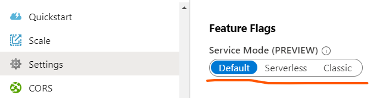

# How to troubleshooting issues

- [Default mode troubleshooting](#default_mode_tsg)
    - [How to view traffic](#view_traffic)
        - [Client requests](#view_traffic_client)
        - [Server requests](#view_traffic_server)
    - [How to add logs](#add_logs)
        - [Client-side logs](#add_logs_client)
        - [Server-side logs](#add_logs_server)
            - [For ASP.NET Core SignalR](#add_logs_server_aspnetcore)
            - [For ASP.NET SignalR](#add_logs_server_aspnet)
#### How to enable server-side log
- [Serverless mode troubleshooting](#serverless_mode_tsg)
- [Classic mode troubleshooting](#classic_mode_tsg)

We encountered several times when users say "service is not working", however we need more information in detail to find out the root cause of the "not working" issue. This guidance is to introduce several ways to help do self-diagnosis to find the root cause directly or narrow down the issue and report it to us for further investigation.

First, please check from the Azure portal which  is the Azure SignalR Service (aka. **ASRS**) configured to.
* For `Default` mode, please refer to [default mode troubleshooting](#default_mode_tsg)
* For `Serverless` mode, please refer to [serverless mode troubleshooting](#serverless_mode_tsg)
* For `Classic` mode, please refer to [classic mode troubleshooting](#classic_mode_tsg)

<a name="default_mode_tsg"></a>
## Default mode troubleshooting
When **ASRS** is in *Default* mode, there are **3** roles: *Client*, *Server*, and *Service*:
* *Client*: *Client* stands for the clients connected to **ASRS**. The persistent connections connecting client and **ASRS** are called *Client Connections* in this guidance.
* *Server*: *Server* stands for the server which serves client negotiation and hosts SignalR `Hub` logic. And the persistent connections between *Server* and **ASRS** are called *Server Connections* in this guidance.
* *Service*: *Service* is the short name for **ASRS** in this guidance.

Please refer to [Internals of Azure SignalR Service](./internal.md) for the detailed introduction of the whole architecture and workflow.

When something is not working, the first thing to do is to narrow down the issue. There are several ways that can help to achieve this. If the issue happens right in the way or is repro-able. The straight forward way is to view the on-going traffic. If the issue is hard to repro, traces and logs can help.

<a name="view_traffic"></a>
### How to view the traffic and narrow down the issue
Capturing the on-going traffic is the most straight-forward way to narrow down the issue. You can capture the [Network traces](https://docs.microsoft.com/en-us/aspnet/core/signalr/diagnostics#network-traces) using the options described below:

- [Collect a network trace with Fiddler](https://docs.microsoft.com/en-us/aspnet/core/signalr/diagnostics#network-traces)
- [Collect a network trace with tcpdump](https://docs.microsoft.com/en-us/aspnet/core/signalr/diagnostics#collect-a-network-trace-with-tcpdump-macos-and-linux-only)
- [Collect a network trace in the browser](https://docs.microsoft.com/en-us/aspnet/core/signalr/diagnostics#collect-a-network-trace-in-the-browser)

<a name="view_traffic_client"></a>

For a SignalR persistent connection, it first `/negotiate` to Azure SignalR service and then establishes the real connection to Azure SignalR service. Please refer to [Internals of Azure SignalR Service](./internal.md) for the detailed steps.

With the client side network trace in hand, find the failed request and look for solution inside [Troubleshooting Guide](./tsg.md).

<a name="view_traffic_server"></a>

SignalR *Server* maintains the *Server Connection* between *Server* and *Service*. On a regular basis there are new version releases for the Azure SignalR Service, and sometimes the Azure wide OS patching or upgrades or occasionally interruption from our dependent services. These may bring in a very short period of *Server Connection* drop and reconnect. As long as client-side has the disconnect/reconnect mechanism, the impact is minimal like any client-side caused disconnect-reconnect.

View server side network trace to find out the status code and error detail why *Server Connection* drops or is rejected by the *Service*, and look for the root cause inside [Troubleshooting Guide](./tsg.md).

<a name="add_logs"></a>
### How to add logs
Logs can be really useful to diagnose issues.

<a name="add_logs_client"></a>
#### How to enable client-side log
Client side logging experience is exactly the same as one is using on-premise SignalR.
<a name="add_logs_client_aspnetcore"></a>
##### Enable client side logging for `ASP.NET Core SignalR`
- [JavaScript client logging](https://docs.microsoft.com/en-us/aspnet/core/signalr/diagnostics#javascript-client-logging)
- [.NET client logging](https://docs.microsoft.com/en-us/aspnet/core/signalr/diagnostics#net-client-logging)

<a name="add_logs_client_aspnet"></a>
##### Enable client side logging for `ASP.NET SignalR`
- [.NET client](https://docs.microsoft.com/en-us/aspnet/signalr/overview/testing-and-debugging/enabling-signalr-tracing#enabling-tracing-in-the-net-client-windows-desktop-apps)
- [Enabling tracing in Windows Phone 8 clients](https://docs.microsoft.com/en-us/aspnet/signalr/overview/testing-and-debugging/enabling-signalr-tracing#enabling-tracing-in-windows-phone-8-clients)
- [Enabling tracing in the JavaScript client](https://docs.microsoft.com/en-us/aspnet/signalr/overview/testing-and-debugging/enabling-signalr-tracing#enabling-tracing-in-the-javascript-client)

<a name="add_logs_server"></a>
#### How to enable server-side log
<a name="add_logs_server_aspnetcore"></a>
##### Enable server side logging for `ASP.NET Core SignalR`
Server side logging for `ASP.NET Core SignalR` integrates with the `ILogger` based [logging](https://docs.microsoft.com/en-us/aspnet/core/fundamentals/logging/?view=aspnetcore-2.1&tabs=aspnetcore2x) provided in the `ASP.NET Core` framework. You can enable server side logging by using `ConfigureLogging`, a sample usage as follows:
```cs
.ConfigureLogging((hostingContext, logging) =>
        {
            logging.AddConsole();
            logging.AddDebug();
        })
```
Logger categories for Azure SignalR always starts with `Microsoft.Azure.SignalR`. To enable detailed logs from Azure SignalR, configure the preceding prefixes to `Debug` level in your **appsettings.json** file like below:
```JSON
{
    "Logging": {
        "LogLevel": {
            ...
            "Microsoft.Azure.SignalR": "Debug",
            ...
        }
    }
}
```
<a name="add_logs_server_aspnet"></a>
##### Enable server side traces for `ASP.NET SignalR`
When using SDK version >= `1.0.0`, you can enable traces by adding the following to `web.config`: ([Details](https://github.com/Azure/azure-signalr/issues/452#issuecomment-478858102))
```xml
<system.diagnostics>
    <sources>
      <source name="Microsoft.Azure.SignalR" switchName="SignalRSwitch">
        <listeners>
          <add name="ASRS" />
        </listeners>
      </source>
    </sources>
    <!-- Sets the trace verbosity level -->
    <switches>
      <add name="SignalRSwitch" value="Information" />
    </switches>
    <!-- Specifies the trace writer for output -->
    <sharedListeners>
      <add name="ASRS" type="System.Diagnostics.TextWriterTraceListener" initializeData="asrs.log.txt" />
    </sharedListeners>
    <trace autoflush="true" />
  </system.diagnostics>
```

<a name="serverless_mode_tsg"></a>
## Serverless mode troubleshooting
When **ASRS** is in *Serverless* mode

<a name="classic_mode_tsg"></a>
## Classic mode troubleshooting
When **ASRS** is in *Classic* mode