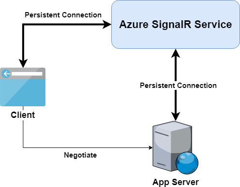

# Internals of Azure SignalR Service

- [Server Connections](#server-connections)
- [Client Connections](#client-connections)
- [Transport Data between Client and Server](#transport)

Azure SignalR Service is built on top of ASP.NET Core SignalR framework, and it supports running both ASP.NET Core SignalR and ASP.NET SignalR. **SignalR** is used in below section as a general term for both ASP.NET Core SignalR and ASP.NET SignalR. 

> To support ASP.NET SignalR, Azure SignalR Service reimplements ASP.NET SignalR's data protocol on top of the ASP.NET Core framework.

You can start from a local **SignalR** application, then seamlessly move to Azure SignalR Service with a few lines of code change.

The following diagram shows the typical architecture when you use Azure SignalR Service with your own application server.
Behavior of clients and servers will be different from self-hosting **SignalR** application.
More details are explained in below sections.



## Server Connections

When self-hosting **SignalR**, application server will listen for client connections and serve them directly.

With SignalR Service, the application server is no longer responsible for accepting persistent client connections.
A `negotiate` endpoint will be exposed by Azure SignalR Service SDK for each hub.

> This is also true for ASP.NET SignalR that each hub has its own server connection to the Azure service. Besides that, ASP.NET SignalR also initiates a per-application server connection to the Azure service. This design is not following the convention of the ASP.NET SignalR that all the hubs share the same connection, but to most part similar as the ASP.NET Core SignalR design.

It will respond to clients' negotiate requests and redirect them to SignalR Service.
Eventually, all clients will be connected to SignalR Service.
Read more about it in [Client Connections](#client-connections) section.

After application server is started, 
* For ASP.NET Core SignalR, the Azure SignalR SDK will open 5 WebSocket connections to the SignalR Service per hub.
* For ASP.NET SignalR, the Azure SignalR SDK will open 5 WebSocket connections to the SignalR Service per hub, and 1 per-application WebSocket connection.

The number of used connections per hub is configurable as described [here](./use-signalr-service.md#connectioncount).
Messages from/to clients will be multiplexed into these connections.

These connections are supposed to be connected to SignalR Service all the time.
If a server connection is disconnected due to network issues,
- all clients which are served by this server connection will be disconnected (read more about client and server pairing at [Transport Data between Client and Server](#transport) section);
- the server connection will automatically start reconnecting.

## Client Connections

When using SignalR Service, clients will be connected with SignalR Service instead of application server.
It is a two-step process to establish persistent connections between clients and SignalR Service.

1. Client sends a negotiate request to application server.
With Azure SignalR Service SDK, application server will return a redirect negotiation response with SignalR Service's URL and access token.
    * For ASP.NET Core SignalR, a typical redirect response looks like as following:

        ```json
        {
            "url":"https://test.service.signalr.net/client/?hub=chat&...",
            "accessToken":"<a typical JWT token>"
        }
        ```

    * For ASP.NET SignalR, a typical redirect response looks like as following:

        ```json
        {
            "ProtocolVersion": "2.0",
            "RedirectUrl":"https://test.service.signalr.net/aspnetclient",
            "AccessToken":"<a typical JWT token>"
        }
        ```
1. After receiving the redirect response, client will use the new URL and access token to start the normal connect process with SignalR Service.

Learn more details in ASP.NET Core SignalR's [transport protocols](https://github.com/aspnet/SignalR/blob/release/2.2/specs/TransportProtocols.md).


<a name="transport"></a>
## Transport Data between Client and Server

When a client is connected to SignalR Service, service runtime will find a server connection to serve this client.
- It only happens once and is a one-to-one mapping between client connections and server connections.
- The mapping is valid in SignalR Service until either the client connection or the server connection disconnects.

Then the application server will receive an event with information of the new client.
A logical client connection will be created in the application server to start the processing pipeline of **SignalR**.

Now the data channel between a client and application server has been established.
SignalR Service will transport data from the client to the pairing application server.
And data from application server will also be delivered to specified clients.

As you might notice, Azure SignalR Service is essentially a logical transport layer between application server and clients.
All persistent connections are offloaded to SignalR Service.
Application server only has to take care of business logics in your hub classes now.
