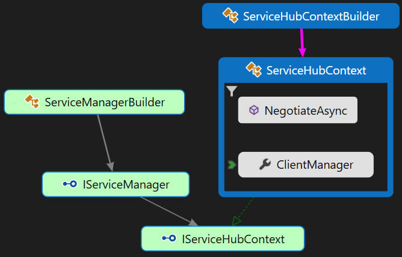

# Migrate from `ServiceManagerBuilder` to `ServiceHubContextBuilder`

## Why Migrate?
* The new APIs provide more functionalities to manage your clients and groups, such as closing a connection by connection id, checking if a connection exists, if a user exists, if a group exists. 
* The new APIs provide more options for negotiation, such as whether the client is a diagnostic client.
* The new APIs are more friendly for negotiation with multiple SignalR Service instances. `IServiceManager.GetClientEndpoint` and `IServiceManager.GenerateClientAccessToken` are combined into one method to make sure the client endpoint and the access token come from the same SignalR Service endpoint. An `HttpContext` instance is allowed to passed into the endpoint router to provide more information for the routing. <!--Todo Add link about sharding doc-->
* New features on the new APIs will be prioritized.

## Overview
The following image shows the relation for the old APIs (green blocks) and the new APIs (blue blocks). Currently, to get a `ServiceHubContext` which implements `IServiceHubContext` interface, you just need to create it directly from `ServiceHubContextBuilder`. The `ServiceHubContext` abstract class combines the functionalities of `IServiceManager` and `IServiceHubContext`.

To negotiate, you get client endpoint and access token from `IServiceManager` with old APIs, while with new APIs, you do this via `ServiceHubContext.NegotiateAsync` method. You don't need to check service health via `IServiceManager.IsServiceHealthy` because `NegotiateAsync` only return healthy endpoints and throw error if none under `Persistent` transport type (Health check under `Transient` transport type is not implemented yet).

