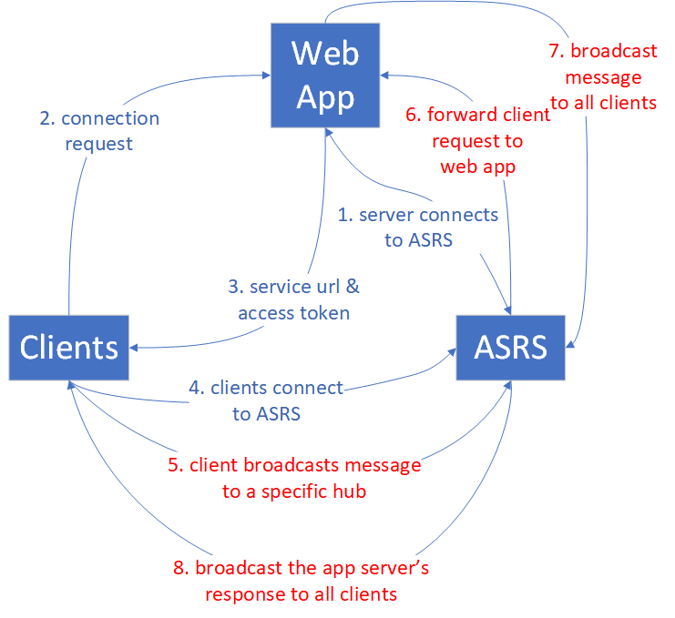
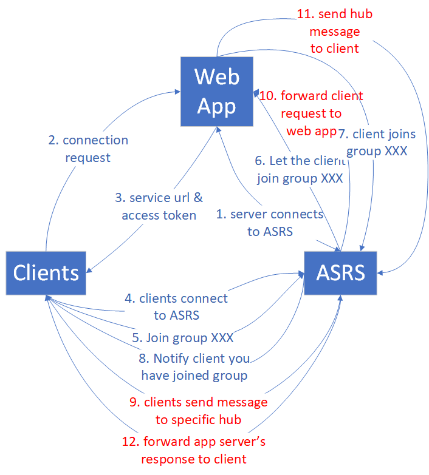
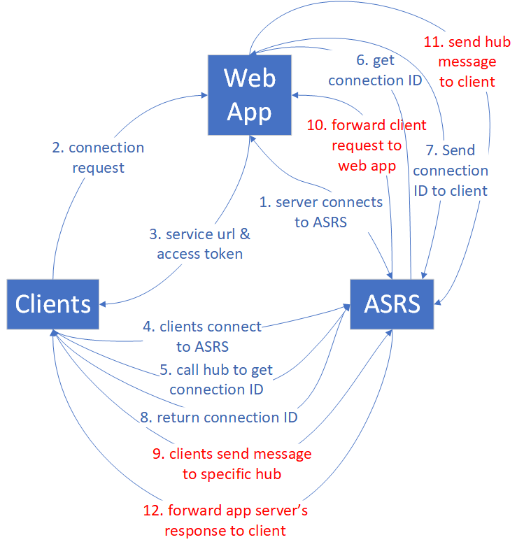

Azure SignalR Service 1.0 Performance Guide
===========================================

- [Terms](#terms)
- [Audience](#audience)
- [Overview](#overview)
- [Performance insight](#perf_insight)
  - [Methodology](#perf_methodology)
  - [Performance factors](#perf_factors)
  - [Find proper SKU](#evaluation)
    - [Quick evaluation](#quick_evaluation)
    - [Evaluation for complex use cases](#mixed_evaluation)
- [Case study](#case_study)
  - [Default mode](#server)
    - [Echo](#echo)
    - [Broadcast](#broadcast)
    - [Send to group](#sendToGroup)
    - [Send to connection](#sendToClient)
    - [AspNet SignalR Echo/Broadcast/SendToConnection](#AspNetSignalR)
  - [Serverless mode](#serverless)
    - [Broadcast through REST API](#restBroadcast)
    - [Send to user through REST API](#restSendToUser)
- [Performance environment](#perf_env)
- [Performance tools](#perf_tool)

<a name="terms"></a>
Terms
-----

*ASRS*: Azure SignalR Service

*Inbound*: the incoming message to Azure SignalR Service

*Outbound*: the outgoing message from Azure SignalR Service

*Bandwidth*: total size of all messages in 1 second

*Default mode*: ASRS expects the app server to establish connection with it before accepting any client connections. This is the default working mode when an ASRS was created.

*Serverless mode*: ASRS only accepts client connections. No server connection is allowed.

<a name="audience"></a>
Audience
--------

Developers of Azure SignalR Service

<a name="overview"></a>
Overview
--------

ASRS defines 7 Standard tiers for different performance capacities, and this
guide intends to answer the following questions:

-   What is the status of ASRS performance for each tier?

-   Does ASRS meet my requirement of message rate, for example, send for 100,000 message per second?

-   For my specific scenario, which tier is suitable for me? Or how can I select the proper tier?

-   What kind of app server (VM size) is suitable for me and how many of them shall I deploy?

To answer those questions, the performance guide first gives a high level explanation about the factors which take impact on performance, then illustrates the maximum inbound
and outbound message for every tier through 4 typical use cases: **echo**, **broadcast**,
**send to group**, and **send to connection** (peer to peer chatting).

Different user has different use cases. It is impossible for this document to enumerate all scenarios (different use case, different message size, or message sending
pattern etc.) in the limited paragraph, however, it provides some evaluation methods to help users to approximately evaluate their requirement of the inbound or outbound message, then find the proper tiers by checking the performance table. 

<a name="perf_insight"></a>
Performance insight
-------------------

This section first describes the performance evaluation methodologies, then lists all factors that take impact on performance, at last provides methods to help evaluate the performance requirements.

<a name="perf_methodology"></a>
### Methodology

**Throughput** and **latency** are two typical aspects of performance checking. For ASRS, different SKU tier has different throughput throttling policy. This document wants to find **the maximum allowed throughput (inbound and outbound bandwidth) with 99% of messages latency less than 1 second**.

The latency is the time span from the connection sending message to receiving the response message from ASRS. Let's take **echo** as an example, every client connection adds a timestamp in the message. App server's hub sends the original message back to the client. So the propagation delay is easily calculated by every client connection. The timestamp is attached for every message in **broadcast**, **send to group**, and **send to connection**.

To simulate thousands of clients connections, a bunch of VMs are created in a virtual private network in Azure. All of them connect to the same ASRS instance.

For ASRS default mode, app servers VMs are also deployed in the same virtual private network as client VMs.

All client VMs and app server VMs are deployed in the same network of the same region to avoid cross region latency.

<a name="perf_factors"></a>
### Performance factors

Theoretically, ASRS' capacity is limited by computation resources: CPU, Memory, and network. For example, more connections to ASRS, more memory ASRS consumed. For larger message traffic, for example, every message is larger than 2048 bytes, it requires ASRS to spend more CPU cycles to process as well. Meanwhile, Azure network bandwidth also imposes a limit for maximum traffic.

The transport type, [Websockets](https://en.wikipedia.org/wiki/WebSocket), [Sever-Sent-Event](https://en.wikipedia.org/wiki/Server-sent_events), or [Long-Polling](https://en.wikipedia.org/wiki/Push_technology) is another factor which impacts performance. Websockets is a bidirectional and full-duplex communication protocol over a single TCP connection. However, Sever-Sent-Event is unidirectional protocol to push message from server to client. Long-Polling requires the clients to poll information from server periodically through HTTP request. For the same API, Websockets shows the best performance, Sever-Sent-Event is worse, and Long-Polling is the worst. ASRS recommends Websockets by default.

In addition, the cost of message routing also limits the performance. ASRS plays a role of router, which routes the message from a bunch of clients or servers to other clients or servers. Different scenario or API requires different routing. For **echo**, the client sends a message to itself, and the routing destination is also itself. This is the lowest cost routing. But for **broadcast**, **send to group**, **send to connection**, ASRS has to find the target connections through the internal distributed data structure, which consumes more CPU, Memory and even network bandwidth. As a result, performance is not as good as **echo**.

On the default mode, the app server may also become a bottleneck for some scenarios, because Azure SignalR SDK has to invoke the Hub, meanwhile it maintains the connection with every client connection through heart-beat.

On serverless mode, the client sends message by HTTP post which is not as efficient as Websockets.

Another possible factor is protocol: JSON and [MessagePack](https://msgpack.org/index.html). MessagePack is more compact and faster than JSON. Intuitively, MessagePack benefits performance, but ASRS performance is not sensitive with protocols since it does not decode the message payload during forwarding message from clients to servers or vice verse.

As a summary, the inbound and outbound capacity is impacted by the following factors:

-   SKU tier (CPU/Memory)

-   connection number

-   message size

-   message send rate

-   transport type (Websockets/Sever-Sent-Event/Long-Polling)

-   use case (routing cost)

-   app server and server connections (on server mode)

<a name="evaluation"></a>
### Find a proper SKU

How to evaluate the inbound/outbound capacity or how to find which tier is suitable for a specific use case?

We assume the app server is powerful enough and is not the performance bottleneck. Then we can check the maximum inbound and outbound bandwidth for every tier.

<a name="quick_evaluation"></a>
#### Quick evaluation

Let's simplify the evaluation first by assuming some default settings: Websockets is applied, message size is 2048 bytes, sending message every 1 second, and apply default mode.

Every tier has its own maximum inbound bandwidth and outbound bandwidth. Fluent user experience cannot be guaranteed once the inbound or outbound exceeds the limit.

**Echo** gives the maximum inbound bandwidth because it has the lowest routing cost. **Broadcast** defines the maximum outbound message bandwidth.

Please do **NOT** exceed the highlighted values in the following two tables.

|       Echo                        | Unit1 | Unit2 | Unit5 | Unit10 | Unit20 | Unit50 | Unit100 |
|-----------------------------------|-------|-------|-------|--------|--------|--------|---------|
| Connections                       | 1,000 | 2,000 | 5,000 | 10,000 | 20,000 | 50,000 | 100,000 |
| **Inbound bandwidth (byte/s)** | **2M**    | **4M**    | **10M**   | **20M**    | **40M**    | **100M**   | **200M**    |
| Outbound bandwidth (byte/s) | 2M    | 4M    | 10M   | 20M    | 40M    | 100M   | 200M    |


|     Broadcast             | Unit1 | Unit2 | Unit5  | Unit10 | Unit20 | Unit50  | Unit100 |
|---------------------------|-------|-------|--------|--------|--------|---------|---------|
| Connections               | 1,000 | 2,000 | 5,000  | 10,000 | 20,000 | 50,000  | 100,000 |
| Inbound bandwidth (byte/s)  | 4K    | 4K    | 4K     | 4K     | 4K     | 4K      | 4K     |
| **Outbound Bandwidth (byte/s)** | **4M**    | **8M**    | **20M**    | **40M**    | **80M**    | **200M**    | **400M**   |

The inbound bandwidth and outbound bandwidth formulas:
```
  inboundBandwidth = inboundConnections * messageSize / sendInterval
  outboundBandwidth = outboundConnections * messageSize / sendInterval
```

*inboundConnections*: the number of connections sending message

*outboundConnections*: the number of connections receiving message

*messageSize*: the size of a single message (average value). For small message whose size is less than 1024 bytes, it has the similar performance impact as 1024 byte message.

*sendInterval*: the time of sending one message, typically it is 1 second per message, which means sending 1 message every second. Smaller sendInterval means sending more message in given time period. For example, 0.5 second per message means sending 2 message every second.

*Connections* is the ASRS committed maximum threshold for every tier. If the connection number is increased further, it will suffer from connection throttling.

*Inbound bandwidth* and *Outbound bandwidth* are the message size per second. Here 'M' means megabyte for simplicity.

<a name="mixed_evaluation"></a>
#### Evaluation for complex use cases

* Bigger message size or different sending rate

The real use case is more complex. It may send message bigger than 2048 bytes, or sending message rate is not 1 message per second. Let's take unit 100's broadcast as an example to find how to evaluate its performance.

The following table gives a real case of **broadcast**, but the message size, connection count, and message sending rate are different from what we assumed in the previous section. The question is how we can deduce any of those items (message size, connection count, or message sending rate) if we only know 2 of them.

| Broadcast  | Message size (byte) | Inbound (message/s) | Connections | Send intervals (second) |
|---|---------------------|--------------------------|-------------|-------------------------|
| 1 | 20K                 | 1                        | 100,000     | 5                       |
| 2 | 256K                | 1                        | 8,000       | 5                       |

The following formula is easily to be inferred based on the previous existing formula:

```
outboundConnections = outboundBandwidth * sendInterval / messageSize
```

For unit 100, we know the max outbound bandwidth is 400M from previous table,
then for 20K message size, the max outbound connections should be 400M \* 5 / 20K =
100,000, which matches the real value.

* Mixed use cases

The real use case typically mixes the 4 basic use cases together: **echo**, **broadcast**, **send to group**, or **send to connection**. The methodology used to evaluate the capacity is to divide the mixed use cases into 4 basic use cases, **calculate the maximum inbound and outbound message bandwidth** using the above formulas separetely, and sum them to get the total maximum inbound/outbound bandwidth. Then pick up the proper tier from the maximum inbound/outbound bandwidth tables.

Meanwhile, for sending message to hundreds or thousand small groups, or thousands of clients sending message to each other, the routing cost will become dominant. This impact should be taken into account. More details is covered in the following "Case study" sections.

For the use case of sending message to clients, make sure the app server is **NOT** the bottleneck. "Case study" section gives the guideline about how many app servers you need and how many server connections should be configured.

<a name="case_study"></a>
Case study
----------

The following sections go through 4 typical use cases for Websockets transport: **echo**, **broadcast**, **send to group**, and **send to connection**. For every scenario, it lists the current ASRS inbound and outbound capacity, meanwhile explains what is the main factors on performance.

On default mode, Azure SignalR SDK default creates 5 server connections with ASRS. In the below performance test, server connections are
increased to 15 (or more for broadcast and send message to big group).

Different use cases have different requirement on app servers. **Broadcast** needs very small number of app servers. **Echo** or **send to connection** needs many app servers.

In all use cases, the default message size is 2048 bytes, and message send
interval is 1 second.

<a name="server"></a>
## Default mode

Clients, web app servers, and ASRS are included under this mode. Every client stands for a single connection.

<a name="echo"></a>
### Echo

Firstly, web apps connect to ASRS. Secondly, thousands of clients connect web app, which redirect the clients to ASRS with the access token. Then, clients establish Websockets connection with ASRS.

After all clients establish connections, they start sending message which contains a timestamp to the specific Hub every second. The Hub echos the message back to its original client. Every client calculates the latency when it receives the echo back message.

The step 5\~8 (red highlighted traffic) are in a loop which will run for a
default duration (5 minutes) and get the statistic of all message latency. 
The performance guide shows the maximum client connection number.


**Echo**'s behavior determines the maximum inbound bandwidth is equal to maximum outbound bandwidth. See the following table.

|       Echo                        | Unit1 | Unit2 | Unit5 | Unit10 | Unit20 | Unit50 | Unit100 |
|-----------------------------------|-------|-------|-------|--------|--------|--------|---------|
| Connections                       | 1,000 | 2,000 | 5,000 | 10,000 | 20,000 | 50,000 | 100,000 |
| Inbound/Outbound (message/s) | 1,000 | 2,000 | 5,000 | 10,000 | 20,000 | 50,000 | 100,000 |
| Inbound/Outbound bandwidth (byte/s) | 2M    | 4M    | 10M   | 20M    | 40M    | 100M   | 200M    |

In this use case, every client invokes the hub defined in the app server. The hub just calls the method defined in the original client side. This is the most light weighed hub for **echo**.

```
        public void Echo(IDictionary<string, object> data)
        {
            Clients.Client(Context.ConnectionId).SendAsync("RecordLatency", data);
        }
```

Even for this simple hub, the traffic pressure on app server is also prominent as the **echo** inbound message increases. Therefore, it requires many app servers for big SKU tiers. The following table lists the app server count for every tier.


|    Echo          | Unit1 | Unit2 | Unit5 | Unit10 | Unit20 | Unit50 | Unit100 |
|------------------|-------|-------|-------|--------|--------|--------|---------|
| Connections      | 1,000 | 2,000 | 5,000 | 10,000 | 20,000 | 50,000 | 100,000 |
| App server count | 2     | 2     | 2     | 3      | 3      | 10     | 20      |

> **Note**
>
> The client connection number, message size, message sending rate, SKU tier and app server's CPU/Memory take impact on overall performance of **echo**.

<a name="broadcast"></a>
### Broadcast

For **broadcast**, when web app receives the message, it broadcasts to all clients. More clients to broadcast, more message traffic to all clients. See the following diagram.

<a name="broadcast_img"></a>


The characteristic of broadcast is there are a small number of clients broadcasting, which means the inbound message bandwidth is small, but the outbound bandwidth is huge. The outbound message increase as the client connection or broadcast rate increases.

The maximum client connections, inbound/outbound message count and bandwidth are summarized in the following table.

|     Broadcast             | Unit1 | Unit2 | Unit5  | Unit10 | Unit20 | Unit50  | Unit100 |
|---------------------------|-------|-------|--------|--------|--------|---------|---------|
| Connections               | 1,000 | 2,000 | 5,000  | 10,000 | 20,000 | 50,000  | 100,000 |
| Inbound (message/s)  | 2     | 2     | 2      | 2      | 2      | 2       | 2       |
| Outbound (message/s) | 2,000 | 4,000 | 10,000 | 20,000 | 40,000 | 100,000 | 200,000 |
| Inbound bandwidth (byte/s)  | 4K    | 4K    | 4K     | 4K     | 4K     | 4K      | 4K      |
| Outbound bandwidth (byte/s) | 4M    | 8M    | 20M    | 40M    | 80M    | 200M    | 400M    |

The broadcasting client count is no bigger than 4, thus requires less app servers compared with **echo** since its the inbound message is very small. 2 app servers are enough for both SLA and performance consideration. But the default server connections should be increased to avoid unbalanced issue especially for Unit50 and Unit100.

|   Broadcast      | Unit1 | Unit2 | Unit5 | Unit10 | Unit20 | Unit50 | Unit100 |
|------------------|-------|-------|-------|--------|--------|--------|---------|
| Connections      | 1,000 | 2,000 | 5,000 | 10,000 | 20,000 | 50,000 | 100,000 |
| App server count | 2     | 2     | 2     | 2      | 2      | 2      | 2       |

> **Note**
> 
> Increase the default server connections from 5 to 40 on every app server to
> avoid possible unbalanced server connections to ASRS.
> 
> The client connection number, message size, message sending rate, and unit tier take impact on overall performance of **broadcast**

<a name="sendToGroup"></a>
### Send to group

**Send to group** has the similar traffic except that after clients establish Websockets connections with ASRS, they must join groups
before sending message to a specific group. The traffic flow is illustrated by the following diagram.



Group member and group count are two factors which impact the performance. To
simplify the analysis, here defines two kinds of groups: small group, and big
group.

- `small group`: 10 connections in every group. The group number is equal to (total
connection count) / 10. For example, for Unit 1, if there are 1000 connection
count, then we have 1000 / 10 = 100 groups.

- `Big group`: Group number is always 10. The group member count is equal to (total
connection count) / 10. For example, for Unit 1, if there are 1000 connection
count, then every group has 1000 / 10 = 100 members.

**Send to group** brings routing cost to ASRS because it has to find the target connections through a distributed data structure. As the sending connection increases, the cost increased as well.

#### small group

The routing cost is prominent for sending message to many small groups. Currently, the ASRS implementation hits routing cost limit for unit 50. More CPU and memory do not help, and that is why unit 100 cannot improve on this use case, which is by design. If you demands more inbound bandwidth, please contact us for customization.

|   Send to small group     | Unit1 | Unit2 | Unit5  | Unit10 | Unit20 | Unit50 | Unit100 |
|---------------------------|-------|-------|--------|--------|--------|--------|---------|
| Connections               | 1,000 | 2,000 | 5,000  | 10,000 | 20,000 | 50,000 | 100,000
| Group member count        | 10    | 10    | 10     | 10     | 10     | 10     | 10 
| Group count               | 100   | 200   | 500    | 1,000  | 2,000  | 5,000  | 10,000 
| Inbound (message/s)  | 200   | 400   | 1,000  | 2,500  | 4,000  | 7,000  | 7,000   |
| Inbound bandwidth (byte/s)  | 400K  | 800K  | 2M     | 5M     | 8M     | 14M    | 14M     |
| Outbound (message/s) | 2,000 | 4,000 | 10,000 | 25,000 | 40,000 | 70,000 | 70,000  |
| Outbound bandwidth (byte/s) | 4M    | 8M    | 20M    | 50M     | 80M    | 140M   | 140M    |


There are many client connections calling the hub, therefore, app server number is also critical for performance. The suggested app server count is listed in the following table.

|  Send to small group   | Unit1 | Unit2 | Unit5 | Unit10 | Unit20 | Unit50 | Unit100 |
|------------------|-------|-------|-------|--------|--------|--------|---------|
| Connections      | 1,000 | 2,000 | 5,000 | 10,000 | 20,000 | 50,000 | 100,000 |
| App server count | 2     | 2     | 2     | 3      | 3      | 10     | 20      |

> **Note**
>
> The client connection number, message size, message sending rate, routing cost, unit tier and app server's CPU/Memory take impact on overall performance of **send to small group**.

#### big group

For **sending message to big groups**, the outbound bandwidth becomes the bottleneck before hitting the routing cost limit. The following table lists the maximum outbound bandwidth, which is almost the same as **broadcast**.

|    Send to big group      | Unit1 | Unit2 | Unit5  | Unit10 | Unit20 | Unit50  | Unit100 |
|---------------------------|-------|-------|--------|--------|--------|---------|---------|
| Connections               | 1,000 | 2,000 | 5,000  | 10,000 | 20,000 | 50,000  | 100,000
| Group member count        | 100   | 200   | 500    | 1,000  | 2,000  | 5,000   | 10,000 
| Group count               | 10    | 10    | 10     | 10     | 10     | 10      | 10
| Inbound (message/s)  | 20    | 20    | 20     | 20     | 20     | 20      | 20      |
| Inbound bandwidth (byte/s)  | 80K   | 40K   | 40K    | 20K    | 40K    | 40K     | 40K     |
| Outbound (message/s) | 2,000 | 4,000 | 10,000 | 20,000 | 40,000 | 100,000 | 200,000 |
| Outbound bandwidth (byte/s) | 8M    | 8M    | 20M    | 40M    | 80M    | 200M    | 400M    |

The sending connection count is no more than 40, then the burden on app server is small, thus the suggested web app number is also small.

|  Send to big group  | Unit1 | Unit2 | Unit5 | Unit10 | Unit20 | Unit50 | Unit100 |
|------------------|-------|-------|-------|--------|--------|--------|---------|
| Connections      | 1,000 | 2,000 | 5,000 | 10,000 | 20,000 | 50,000 | 100,000 |
| App server count | 2     | 2     | 2     | 2      | 2      | 2      | 2       |

> **Note**
>
> Increase the default server connections from 5 to 40 on every app server to
> avoid possible unbalanced server connections to ASRS.
> 
> The client connection number, message size, message sending rate, routing cost, and unit tier take impact on overall performance of **send to big group**.

<a name="sendToClient"></a>
### Send to connection

In this use case, when clients establish the connections to ASRS, every client calls a special hub to get their own connection ID. The performance benchmark is responsible to collect all connection IDs, shuffle them and re-assign them to all clients as a sending target. The clients keep on sending message to the target connection until the performance test finishes.



The routing cost for **Send to connection** is similar as **send to small group**.

As the connection increases, the overall performance is limited by routing cost. Unit 50 has reached the limit. As a result, unit 100 cannot improve further.

The following table is a statistic summary after many times running of **send to connection** benchmark

|   Send to connection   | Unit1 | Unit2 | Unit5 | Unit10 | Unit20 | Unit50          | Unit100         |
|------------------------------------|-------|-------|-------|--------|--------|-----------------|-----------------|
| Connections                        | 1,000 | 2,000 | 5,000 | 10,000 | 20,000 | 50,000          | 100,000         |
| Inbound/ Outbound (message/s) | 1,000 | 2,000 | 5,000 | 8,000  | 9,000  | 20,000 | 20,000 |
| Inbound/ Outbound bandwidth (byte/s) | 2M    | 4M    | 10M   | 16M    | 18M    | 40M       | 40M       |

This use cases requires high load on app server side. See the suggested app server count in the following table.

|  Send to connection  | Unit1 | Unit2 | Unit5 | Unit10 | Unit20 | Unit50 | Unit100 |
|------------------|-------|-------|-------|--------|--------|--------|---------|
| Connections      | 1,000 | 2,000 | 5,000 | 10,000 | 20,000 | 50,000 | 100,000 |
| App server count | 2     | 2     | 2     | 3      | 3      | 10     | 20      |

> **Note**
>
> The client connection number, message size, message sending rate, routing cost, unit tier and app server's CPU/Memory take impact on overall performance of **send to connection**.

<a name="AspNetSignalR"></a>
### AspNet SignalR Echo/Broadcast/SendToConnection

ASRS provides the same performance capacity for AspNet SignalR. This section gives the suggested web app count for AspNet SignalR **echo**, **broadcast**, and **send to a small group**.

The performance test uses Azure Web App of [Standard Service Plan S3](https://azure.microsoft.com/en-us/pricing/details/app-service/windows/) for AspNet SignalR.

- `echo`

|   Echo           | Unit1 | Unit2 | Unit5 | Unit10 | Unit20 | Unit50 | Unit100 |
|------------------|-------|-------|-------|--------|--------|--------|---------|
| Connections      | 1,000 | 2,000 | 5,000 | 10,000 | 20,000 | 50,000 | 100,000 |
| App server count | 2     | 2     | 4     | 4      | 8      | 32      | 40       |

- `broadcast`

|  Broadcast       | Unit1 | Unit2 | Unit5 | Unit10 | Unit20 | Unit50 | Unit100 |
|------------------|-------|-------|-------|--------|--------|--------|---------|
| Connections      | 1,000 | 2,000 | 5,000 | 10,000 | 20,000 | 50,000 | 100,000 |
| App server count | 2     | 2     | 2     | 2      | 2      | 2      | 2       |

- `Send to small group`

|  Send to small group     | Unit1 | Unit2 | Unit5 | Unit10 | Unit20 | Unit50 | Unit100 |
|------------------|-------|-------|-------|--------|--------|--------|---------|
| Connections      | 1,000 | 2,000 | 5,000 | 10,000 | 20,000 | 50,000 | 100,000 |
| App server count | 2     | 2     | 4     | 4      | 8      | 32      | 40       |

<a name="serverless"></a>
Serverless mode
---------------

Clients and ASRS are included under this mode. Every client stands for a single connection. The client sends messages through REST API to another client or broadcast message to all.

Sending high density messages through REST API is not as efficient as Websockets, because it requires to build a new HTTP connection every time. This is a special cost under serverless mode.

<a name="restBroadcast"></a>
### Broadcast through REST API
All clients establish Websockets connections with ASRS. After that some of clients start broadcasting through REST API. The message sending (inbound) are all through HTTP Post, which is not efficient compared with Websockets.

|   Broadcast through REST API     | Unit1 | Unit2 | Unit5  | Unit10 | Unit20 | Unit50  | Unit100 |
|---------------------------|-------|-------|--------|--------|--------|---------|---------|
| Connections               | 1,000 | 2,000 | 5,000  | 10,000 | 20,000 | 50,000  | 100,000 |
| Inbound (message/s)  | 2     | 2     | 2      | 2      | 2      | 2       | 2       |
| Outbound (message/s) | 2,000 | 4,000 | 10,000 | 20,000 | 40,000 | 100,000 | 200,000 |
| Inbound bandwidth (byte/s)  | 4K    | 4K    | 4K     | 4K     | 4K     | 4K      | 4K      |
| Outbound bandwidth (byte/s) | 4M    | 8M    | 20M    | 40M    | 80M    | 200M    | 400M    |

<a name="restSendToUser"></a>
### Send to user through REST API
The benchmark assigns user names to all of the clients before they start connecting to ASRS. After the clients established Websockets connections with ASRS, they start sending messages to others through HTTP Post.

|   Send to user through REST API | Unit1 | Unit2 | Unit5  | Unit10 | Unit20 | Unit50  | Unit100 |
|---------------------------|-------|-------|--------|--------|--------|---------|---------|
| Connections               | 1,000 | 2,000 | 5,000  | 10,000 | 20,000 | 50,000  | 100,000 |
| Inbound (message/s)  | 300   | 600   | 900    | 1,300  | 2,000  | 10,000  | 18,000  |
| Outbound (message/s) | 300   | 600   | 900    | 1,300  | 2,000  | 10,000  | 18,000 |
| Inbound bandwidth (byte/s)  | 600K  | 1.2M  | 1.8M   | 2.6M   | 4M     | 10M     | 36M    |
| Outbound bandwidth (byte/s) | 600K  | 1.2M  | 1.8M   | 2.6M   | 4M     | 10M     | 36M    |


<a name="perf_env"></a>
Performance environments
------------------------

The performance test for all uses cases listed above were conducted in Azure
environment. At most 50 client VMs, and 20 app server VMs are used.

Client VM size: StandardDS2V2 (2 vCPU, 7 G memory)

App server VM size: StandardF4sV2 (4 vCPU, 8 G memory)

Azure SignalR SDK server connections: 15

<a name="perf_tool"></a>
Performance tools
-----------------

https://github.com/Azure/azure-signalr-bench/tree/master/SignalRServiceBenchmarkPlugin
