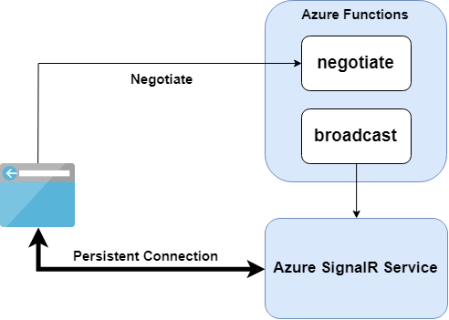

# REST API in Azure SignalR Service

> **NOTE**
>
> Azure SignalR Service only supports REST API for ASP.NET CORE SignalR applications.

- [Typical Server-less Architecture](#serverless)
- [API](#api)
    - [Broadcast message to all clients](#broadcast)
    - [Broadcast message to a group](#broadcast-group)
    - [Send message to a user](#send-user)
    - [Add a user to a group](#add-user-to-group)
    - [Remove a user from a group](#remove-user-from-group)
    - [Remove a user from all groups](#remove-user-from-all-groups)
- [Using REST API](#using-rest-api)
    - [Authentication](#authentication)
        - [Signing Algorithm and Signature](#signing)
        - [Claims](#claims)
    - [User-related REST API](#user-api)
    - [Sample](#sample)

On top of classical client-server pattern, Azure SignalR Service provides a set of REST APIs, so that you can easily integrate real-time functionality into your server-less architecture.

<a name="serverless"></a>
## Typical Server-less Architecture with Azure Functions

The following diagram shows a typical server-less architecture of using Azure SignalR Service with Azure Functions.



- `negotiate` function will return negotiation response and redirect all clients to Azure SignalR Service.
- `broadcast` function will call Azure SignalR Service's REST API. Then SignalR Service will broadcast the message to all connected clients.

In server-less architecture, clients still have persistent connections to Azure SignalR Service.
Since there are no application server to handle traffic, clients are in `LISTEN` mode, which means they can only receive messages but can't send messages.
SignalR Service will disconnect any client who sends messages because it is an invalid operation.

You can find a complete sample of using Azure SignalR Service with Azure Functions at [here](https://github.com/aspnet/AzureSignalR-samples/tree/master/samples/RealtimeSignIn).

## API

The following table shows all versions of REST API we have for now. You can also find the swagger file for each version of REST API.

API Version | Status | Port | Spec
---|---|---|---
`1.0-preview` | Obsolete | Standard | [swagger](./swagger/v1-preview.json)
`1.0` | Available | Standard | [swagger](./swagger/v1.json)

Available APIs of each version are listed as following.

API | `1.0-preview` | `1.0`
---|---|---
[Broadcast to all](#broadcast) | :heavy_check_mark: | :heavy_check_mark:
[Broadcast to a group](#broadcast-group) | :heavy_check_mark: | :heavy_check_mark:
Broadcast to a few groups | :heavy_check_mark: (Deprecated) | `N/A`
[Send to a user](#send-user) | :heavy_check_mark: | :heavy_check_mark:
Send to a few users | :heavy_check_mark: (Deprecated) | `N/A`
[Add a user to a group](#add-user-to-group) | `N/A` | :heavy_check_mark:
[Remove a user from a group](#remove-user-from-group) | `N/A` | :heavy_check_mark:
[Remove a user from all groups](#remove-user-from-all-groups) | `N/A` | :heavy_check_mark: 

<a name="broadcast"></a>

### Broadcast message to all clients

API Version | HTTP Method | Request URL | Request Body
---|---|---|---
`1.0-preview` | `POST` | `https://<instance-name>.service.signalr.net/api/v1-preview/hub/<hub-name>` | `{ "target":"<method-name>", "arguments":[ ... ] }`
`1.0` | `POST` | `https://<instance-name>.service.signalr.net/api/v1/hubs/<hub-name>` | Same as above

<a name="broadcast-group"></a>
### Broadcast message to a group

API Version | HTTP Method | Request URL | Request Body
---|---|---|---
`1.0-preview` | `POST` | `https://<instance-name>.service.signalr.net/api/v1-preview/hub/<hub-name>/group/<group-name>` | `{ "target":"<method-name>", "arguments":[ ... ] }`
`1.0` | `POST` | `https://<instance-name>.service.signalr.net/api/v1/hubs/<hub-name>/groups/<group-name>` | Same as above

<a name="send-user"></a>
### Send message to a user

API Version | HTTP Method | Request URL | Request Body
---|---|---|---
`1.0-preview` | `POST` | `https://<instance-name>.service.signalr.net/api/v1-preview/hub/<hub-name>/user/<user-id>` | `{ "target":"<method-name>", "arguments":[ ... ] }`
`1.0` | `POST` | `https://<instance-name>.service.signalr.net/api/v1/hubs/<hub-name>/users/<user-id>` | Same as above

<a name="add-user-to-group"></a>
### Add a user to a group

API Version | HTTP Method | Request URL
---|---|---
`1.0` | `PUT` | `https://<instance-name>.service.signalr.net/api/v1/hubs/<hub-name>/groups/<group-name>/users/<user-id>`

<a name="remove-user-from-group"></a>

### Remove a user from a group

API Version | HTTP Method | Request URL
---|---|---
`1.0` | `DELETE` | `https://<instance-name>.service.signalr.net/api/v1/hubs/<hub-name>/groups/<group-name>/users/<user-id>`

<a name="remove-user-from-all-groups"></a>

### Remove a user from all groups

| API Version | HTTP Method | Request URL                                                  |
| ----------- | ----------- | ------------------------------------------------------------ |
| `1.0`       | `DELETE`    | `https://<instance-name>.service.signalr.net/api/v1/hubs/<hub-name>/users/<user-id>/groups` |


## Using REST API

### Authentication

In each HTTP request, an authorization header with a [JSON Web Token (JWT)](https://en.wikipedia.org/wiki/JSON_Web_Token) is required to authenticate with Azure SignalR Service.

<a name="signing"></a>
#### Signing Algorithm and Signature

`HS256`, namely HMAC-SHA256, is used as the signing algorithm.

You should use the `AccessKey` in Azure SignalR Service instance's connection string to sign the generated JWT token.

#### Claims

Below claims are required to be included in the JWT token.

Claim Type | Is Required | Description
---|---|---
`aud` | true | Should be the **SAME** as your HTTP request url, trailing slash and query parameters not included. For example, a broadcast request's audience should look like: `https://example.service.signalr.net/api/v1/hubs/myhub`.
`exp` | true | Epoch time when this token will be expired.

### Implement Negotiate Endpoint

As shown in the [architecture section](#serverless), you should implement a `negotiate` function that returns a redirect negotiation response so that client can connect to the service.
A typical negotiation response looks like as following:

```json
{
    "url":"https://<service_name>.service.signalr.net/client/?hub=<hub_name>",
    "accessToken":"<a typical JWT token>"
}
```

The `accessToken` is generated using the same algorithm described in [authentication section](#authentication). The only difference is the `aud` claim should be same as `url`.

You should host your negotiate API in `https://<hub_url>/negotiate` so you can still use SignalR client to connect to the hub url.

Read more about redirecting client to Azure SignalR Service at [here](./internal.md#client-connections).

<a name="user-api"></a>

### User-related REST API

In order to call user-related REST API, each of your clients should identify itself to Azure SignalR Service.
Otherwise SignalR Service can't find target connections from a given user id.

This can be achieved by including a `nameid` claim in each client's JWT token when they are connecting to Azure SignalR Service.
Then SignalR Service will use the value of `nameid` claim as the user id of each client connection.

### Sample

You can find a complete console app to demonstrate how to manually build REST API HTTP request in Azure SignalR Service [here](https://github.com/aspnet/AzureSignalR-samples/tree/master/samples/Serverless).

You can also use [Microsoft.Azure.SignalR.Management](<https://www.nuget.org/packages/Microsoft.Azure.SignalR.Management>) to publish messages to Azure SignalR Service using the similar interfaces of `IHubContext`. Samples can be found [here](<https://github.com/aspnet/AzureSignalR-samples/tree/master/samples/Management>). For more information, see [here](management-sdk-guide.md>).