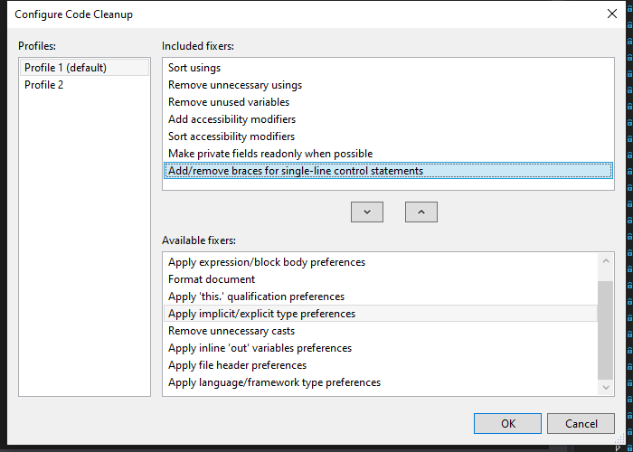
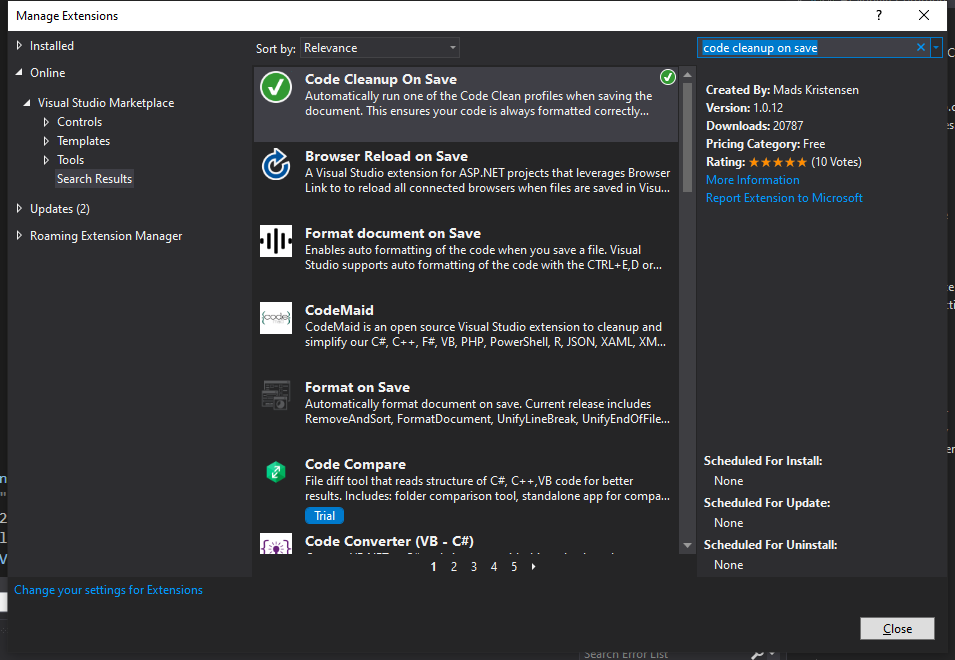
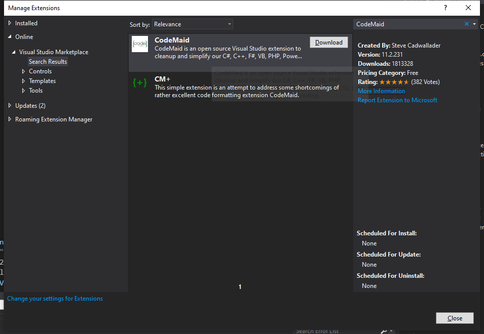

# How to setup code check tools in Visual Studio 2019

## Configure code cleanup tool

1. Open solution, right click on any of the project, select `Analyze and Code Cleanup`, than open `Configure Code Cleanup`.

2. Config your profile as the following.

3. Make sure to `Run Code Cleanup` with the profile every time before you check in your codes.

## Configure auto code cleanup when saving

It's recommend to use an automation tool to help you reformat your codes.

1. Open `Extension Manager`, search **Code Cleanup On Save**.

2. Download it.

3. Restart the `Visual Studio 2019` to install the extension.

4. Now the `Code Cleanup` will be automatically triggered when you save the codes.

## Configure code reorganize tool

It's our convention to sort `field`, `property` and `method` from **public to private**.

However, `Visual Studio 2019` does not have a built-in tool that can help us do this.

Fortunately, there is an extension [CodeMaid](https://www.codemaid.net/) who has the feature.

1. Open `Extension Manager`, search **CodeMaid**.

2. Download it.
3. Restart the `Visual Studio 2019` to install the extension.
4. Than you will get a powerful `Cleanup Selected Code` feature on your right-click menu, it will also help you `Reorganize` other than just run `Code Cleanup`.