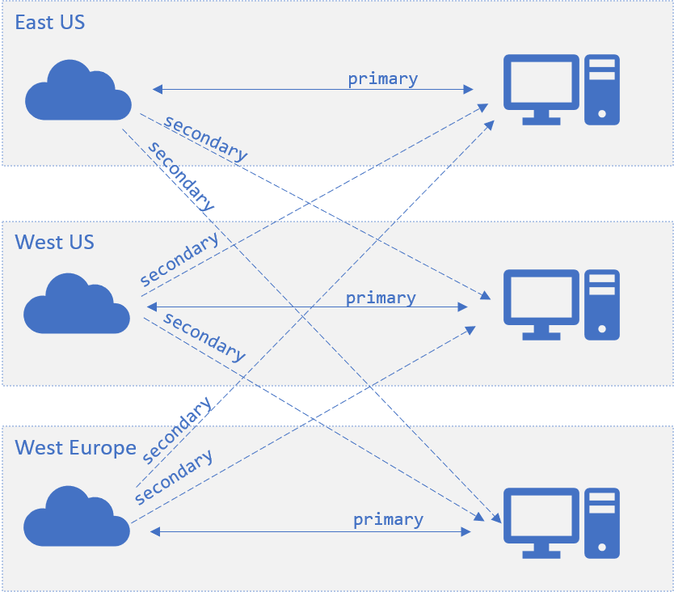

# Multiple SignalR service endpoint support
In latest SDK, we add support for configuring multiple SignalR service instances. This feature can be used to increase the scale of concurrent connections, and can also be used in cross-region scenarios.

* [For ASP.NET Core SignalR](#aspnetcore)
    * [How to add multiple endpoints from config](#aspnetcore-config)
    * [How to add multiple endpoints from code](#aspnetcore-code)
    * [How to customize endpoint router](#customize-router)

* [For ASP.NET SignalR](#aspnet)
    * [How to add multiple endpoints from config](#aspnet-config)
    * [How to add multiple endpoints from code](#aspnet-code)
    * [How to customize endpoint router](#aspnet-customize-router)
* [Configuration in cross-geo scenarios](#cross-geo)
* [Failover](#failover)

## For ASP.NET Core
<a name="aspnetcore"></a>

### How to add multiple endpoints from config
<a name="aspnetcore-config"></a>

Config with key `Azure:SignalR:ConnectionString` or starting with `Azure:SignalR:ConnectionString:` is considered as an SignalR Service connection string.

If the key starts with `Azure:SignalR:ConnectionString:`, it is in format `Azure:SignalR:ConnectionString:{Name}:{EndpointType}`, `Name` and `EndpointType` are properties of the `ServiceEndpoint` object, and is accessible from code.

You can add multiple instance connection strings using the following `dotnet` commands:

```batch
dotnet user-secrets set Azure:SignalR:ConnectionString:east-region-a <ConnectionString1>
dotnet user-secrets set Azure:SignalR:ConnectionString:east-region-b:primary <ConnectionString2>
dotnet user-secrets set Azure:SignalR:ConnectionString:backup:secondary <ConnectionString3>
```

### How to add multiple endpoints from code
<a name="aspnetcore-code"></a>

A `ServicEndpoint` class is introduced in to describe the properties of an Azure SignalR Service endpoint.
You can configure multiple instance endpoints when using Azure SignalR Service SDK through:
```cs
services.AddSignalR()
        .AddAzureSignalR(options => 
        {
            options.Endpoints = new ServiceEndpoint[]
            {
                // Note: this is just a demonstration of how to set options.Endpoints
                // Having ConnectionStrings explicitly set inside the code is not encouraged
                // You can fetch it from a safe place such as Azure KeyVault
                new ServiceEndpoint("<ConnectionString0>"),
                new ServiceEndpoint("<ConnectionString1>", type: EndpointType.Primary, name: "east-region-a"),
                new ServiceEndpoint("<ConnectionString2>", type: EndpointType.Primary, name: "east-region-b"),
                new ServiceEndpoint("<ConnectionString3>", type: EndpointType.Secondary, name: "backup"),
            };
        });
```

### How to customize endpoint router
<a name="customize-router"></a>

By default, the SDK uses the [DefaultEndpointRouter](../src/Microsoft.Azure.SignalR/EndpointRouters/DefaultEndpointRouter.cs) to pick up endpoints.

#### Default behavior 
1. Client request routing

    When client `/negotiate` with the app server. By default, SDK **randomly select** one endpoint from the set of available service endpoints.

2. Server message routing

    When it is *sending message to some **connection***, and the target connection is routed to current server, the message goes back directly to that connected endpoint;
for other cases, the messages are broadcasted to every Azure SignalR endpoint.

#### Customize route algorithm
You can create your own router when you have special knowledge to identify which endpoints the messages should go to. 

Below defines a custom router when groups starting with `east-` always go to the endpoint named `east`:

```cs
private class CustomRouter : EndpointRouterDecorator
{
    public override IEnumerable<ServiceEndpoint> GetEndpointsForGroup(string groupName, IEnumerable<ServiceEndpoint> endpoints)
    {
        // Override the group broadcast behavior, if the group name starts with "east-", only send messages to endpoints inside east
        if (groupName.StartsWith("east-"))
        {
            return endpoints.Where(e => e.Name.StartsWith("east-"));
        }

        return base.GetEndpointsForGroup(groupName, endpoints);
    }
}
```

Below is another example, that overrides the default negotiate behavior, to select the endpoints depends on where the app server locates.

```cs
private class CustomRouter : EndpointRouterDecorator
{
    public override ServiceEndpoint GetNegotiateEndpoint(HttpContext context, IEnumerable<ServiceEndpoint> endpoints)
    {
        // Override the negotiate behavior to get the endpoint from query string
        var endpointName = context.Request.Query["endpoint"];
        if (endpointName.Count == 0)
        {
            context.Response.StatusCode = 400;
            var response = Encoding.UTF8.GetBytes("Invalid request");
            context.Response.Body.Write(response, 0, response.Length);
            return null;
        }

        return endpoints.FirstOrDefault(s => s.Name == endpointName && s.Online) // Get the endpoint with name matching the incoming request
               ?? base.GetNegotiateEndpoint(context, endpoints); // Or fallback to the default behavior to randomly select one from primary endpoints, or fallback to secondary when no primary ones are online
    }
}
```

And don't forget to register the router to DI container using:

```cs
services.AddSingleton(typeof(IEndpointRouter), typeof(CustomRouter));
services.AddSignalR()
        .AddAzureSignalR(
            options => 
            {
                options.Endpoints = new ServiceEndpoint[]
                {
                    new ServiceEndpoint(name: "east", connectionString: "<connectionString1>"),
                    new ServiceEndpoint(name: "west", connectionString: "<connectionString2>"),
                    new ServiceEndpoint("<connectionString3>")
                };
            });
```

## For ASP.NET
<a name="aspnet"></a>

### How to add multiple endpoints from config
<a name="aspnet-config"></a>

Config with key `Azure:SignalR:ConnectionString` or starting with `Azure:SignalR:ConnectionString:` is considered as an SignalR Service connection string.

If the key starts with `Azure:SignalR:ConnectionString:`, it is in format `Azure:SignalR:ConnectionString:{Name}:{EndpointType}`, `Name` and `EndpointType` are properties of the `ServiceEndpoint` object, and is accessible from code.

You can add multiple instance connection strings to `web.config`:

```xml
<?xml version="1.0" encoding="utf-8" ?>
<configuration>
  <connectionStrings>
    <add name="Azure:SignalR:ConnectionString" connectionString="<ConnectionString1>"/>
    <add name="Azure:SignalR:ConnectionString:en-us" connectionString="<ConnectionString2>"/>
    <add name="Azure:SignalR:ConnectionString:zh-cn:secondary" connectionString="<ConnectionString3>"/>
    <add name="Azure:SignalR:ConnectionString:Backup:secondary" connectionString="<ConnectionString4>"/>
  </connectionStrings>
  ...
</configuration>
```

### How to add multiple endpoints from code
<a name="aspnet-code"></a>

A `ServicEndpoint` class is introduced in to describe the properties of an Azure SignalR Service endpoint.
You can configure multiple instance endpoints when using Azure SignalR Service SDK through:

```cs
app.MapAzureSignalR(
    this.GetType().FullName, 
    options => {
            options.Endpoints = new ServiceEndpoint[]
            {
                // Note: this is just a demonstration of how to set options.Endpoints
                // Having ConnectionStrings explicitly set inside the code is not encouraged
                // You can fetch it from a safe place such as Azure KeyVault
                new ServiceEndpoint("<ConnectionString1>"),
                new ServiceEndpoint("<ConnectionString2>"),
                new ServiceEndpoint("<ConnectionString3>"),
            }
        });
```

### How to customize router
<a name="aspnet-customize-router"></a>

The only difference between ASP.NET SignalR and [the Core one](#customize-router) is the http context type for [GetNegotiateEndpoint]. For ASP.NET SignalR, it is of [IOwinContext](../src/Microsoft.Azure.SignalR.AspNet/EndpointRouters/DefaultEndpointRouter.cs#L19) type.

Below is the custom negotiate example for AspNet SignalR:

```cs
private class CustomRouter : EndpointRouterDecorator
{
    public override ServiceEndpoint GetNegotiateEndpoint(IOwinContext context, IEnumerable<ServiceEndpoint> endpoints)
    {
        // Override the negotiate behavior to get the endpoint from query string
        var endpointName = context.Request.Query["endpoint"];
        if (string.IsNullOrEmpty(endpointName))
        {
            context.Response.StatusCode = 400;
            context.Response.Write("Invalid request.");
            return null;
        }

        return endpoints.FirstOrDefault(s => s.Name == endpointName && s.Online) // Get the endpoint with name matching the incoming request
               ?? base.GetNegotiateEndpoint(context, endpoints); // Or fallback to the default behavior to randomly select one from primary endpoints, or fallback to secondary when no primary ones are online
    }
}
```
And don't forget to register the router to DI container using:

```cs
var hub = new HubConfiguration();
var router = new CustomRouter();
hub.Resolver.Register(typeof(IEndpointRouter), () => router);
app.MapAzureSignalR(GetType().FullName, hub, options => {
    options.Endpoints = new ServiceEndpoint[]
                {
                    new ServiceEndpoint(name: "east", connectionString: "<connectionString1>"),
                    new ServiceEndpoint(name: "west", connectionString: "<connectionString2>"),
                    new ServiceEndpoint("<connectionString3>")
                };
});
```

## Configuration in cross-geo scenarios
<a name="cross-geo"></a>

A `ServiceEndpoint` object has an `EndpointType` property with value `primary` or `secondary`, which can be helpful in cross-geo cases.

In general, `primary` endpoints are considered to have more reliable network connections and are taking client traffics in; `secondary` endpoints are considered to have less reliable network connections and are not taking client traffic in, but only taking server to client side traffic, for example, broadcast messages.

In cross-geo cases, cross-geo network can be comparatively unstable. For one app server located in *East US*, the endpoint located in East US can be marked as `primary` and endpoints in other regions marked as `secondary`. In this way, service endpoints in other regions can **receive** messages from this *East US* app server, but there will be no **cross-geo** clients routed to this app server on the cross-geo unstable server connections, the infrastructure is as below:



When a client `/negotiate` with the app server, with the default router, SDK **randomly select** one endpoint from the set of available `primary` endpoints. When none of the `primary` endpoints are available, SDK then **randmonly select** from the set of all available `secondary` endpoints. The endpoint is **available** when the connection between server and this service endpoint is connected. 

In cross-geo senario, when a client `/negotiate` with the app server hosted in East US, by default it always returns the `primary` endpoint located in East US for the client to establish persistent connection with. When all East US endpoints are not available, the client will then be redirected to endpoints in other regions, such as West US. [Failover](#failover) describes it in detail.


## Failover
<a name="failover"></a>

When all `primary` endpoints are not available, client `/negotiate` picks from the `secondary` endpoints if any exists. In this way, the client is routed to an available `secondary` endpoint. This failover mechanism relies on the settings that all the endpoints should be `primary` endpoints to some app server.


