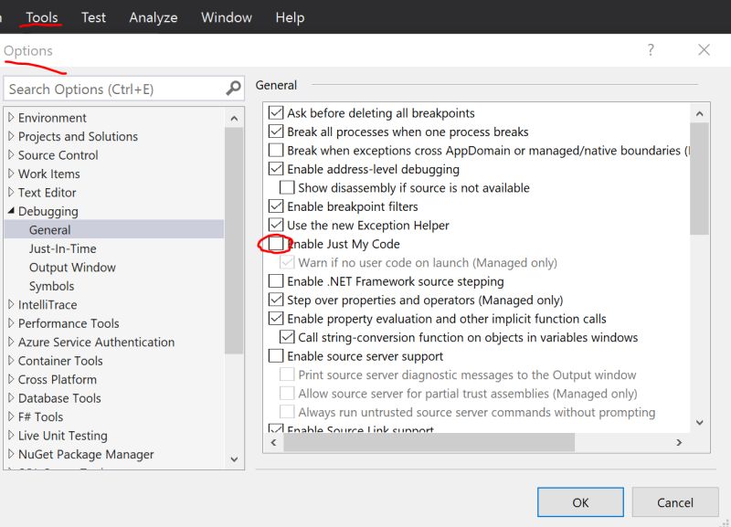
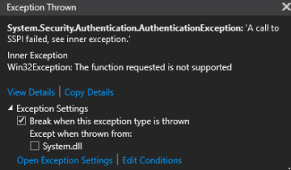

# Troubleshooting Guide

This guidance is to provide useful troubleshooting guide based on the common issues customers encountered and resolved in the past years.

- [Access token too long](#access_token_too_long)
- [TLS 1.2 required](#tls_1.2_required)
- [404 returned for client requests](#random_404_returned_for_client_requests)
- [401 Unauthorized returned for client requests](#401_unauthorized_returned_for_client_requests)
- [500 Error when negotiate](#500_error_when_negotiate)
- [Client connection drop](#client_connection_drop)
- [Server connection drop](#server_connection_drop)

<a name="access_token_too_long"></a>
## Access token too long

### Possible errors:

1. Client-side `ERR_CONNECTION_`
2. 414 URI Too Long
3. 413 Payload Too Large
4. Access Token must not be longer than 4K. 413 Request Entity Too Large

### Root cause:
For HTTP/2, the max length for a single header is **4K**, so if you are using browser to access Azure service, you will encounter this limitation with `ERR_CONNECTION_` error.

For HTTP/1.1, or C# clients, the max URI length is **12K**, the max header length is **16K**.

With SDK version **1.0.6** or higher, `/negotiate` will throw `413 Payload Too Large` when the generated access token is larger than **4K**.

### Solution:
By default, claims from `context.User.Claims` are included when generating JWT access token to **ASRS**(**A**zure **S**ignal**R** **S**ervice), so that the claims are preserved and can be passed from **ASRS** to the `Hub` when the client connects to the `Hub`.

In some cases, `context.User.Claims` are leveraged to store lots of information for app server, most of which are not used by `Hub`s but by other components. 

The generated access token is passed through the network, and for WebSocket/SSE connections, access tokens are passed through query strings. So as the best practice, we suggest only passing **necessary** claims from the client through **ASRS** to your app server when the Hub needs.

There is a `ClaimsProvider` for you to customize the claims passing to **ASRS** inside the access token.

For ASP.NET Core:
```cs
services.AddSignalR()
        .AddAzureSignalR(options =>
            {
                // pick up necessary claims
                options.ClaimsProvider = context => context.User.Claims.Where(...);
            });
```

For ASP.NET:
```cs
services.MapAzureSignalR(GetType().FullName, options =>
            {
                // pick up necessary claims
                options.ClaimsProvider = context.Authentication?.User.Claims.Where(...);
            });
```

### Tips:
<a name="view_request"></a>
* How to view the outgoing request from client?
Take ASP.NET Core one for example (ASP.NET one is similar):
    1. From browser:

        Take Chrome as an example, you can use **F12** to open the console window, and switch to **Network** tab. You might need to refresh the page using **F5** to capture the network from the very beginning.
        
        
    
    2. From C# client:

        You can view local web traffics using [Fiddler](https://www.telerik.com/fiddler). WebSocket traffics are supported since Fiddler 4.5.
        
        

<a name="tls_1.2_required"></a>
## TLS 1.2 required

### Possible errors:

1. ASP.Net "No server available" error [#279](https://github.com/Azure/azure-signalr/issues/279)
2. ASP.Net "The connection is not active, data cannot be sent to the service." error [#324](https://github.com/Azure/azure-signalr/issues/324)
3. "An error occurred while making the HTTP request to https://<API endpoint>. This could be due to the fact that the server certificate is not configured properly with HTTP.SYS in the HTTPS case. This could also be caused by a mismatch of the security binding between the client and the server."
        
### Root cause:
Azure Service only supports TLS1.2 for security concerns. With .NET framework, it is possible that TLS1.2 is not the default protocol. As a result, the server connections to ASRS can not be successfully established.

### Troubleshooting Guide
1. If this error can be repro-ed locally, uncheck *Just My Code* and throw all CLR exceptions and debug the app server locally to see what exception throws.
    * Uncheck *Just My Code*
    
        
    * Throw CLR exceptions
    
        
    * See the exceptions throw when debugging the app server side code:
    
        

2. For ASP.NET ones, you can also add following code to your `Startup.cs` to enable detailed trace and see the errors from the log.
```cs
app.MapAzureSignalR(this.GetType().FullName);
// Make sure this switch is called after MapAzureSignalR
GlobalHost.TraceManager.Switch.Level = SourceLevels.Information;
```

### Solution:

Add following code to your Startup:
```cs
ServicePointManager.SecurityProtocol = SecurityProtocolType.Tls12;
```

<a name="random_404_returned_for_client_requests"></a>
## 404 returned for client requests

For a SignalR persistent connection, it first `/negotiate` to Azure SignalR service and then establishes the real connection to Azure SignalR service. Our load balancer must ensure that the `/negotiate` request and the following connect request goes to the same instance of the Service otherwise 404 occurs. Our load balancer relies on the *asrs_request_id* query string (added in SDK version 1.0.11) or the *signature* part of the generated `access_token`(if `asrs_request_id` query string does not exist) to keep the session sticky.

### Troubleshooting Guide
There are two kind of 404 errors with different symptoms.
1. The symptom for one kind of 404 is that the 404 errors happens **consistently**. For this kind of 404, please check:
    1. Following [How to view outgoing requests](#view_request) to get the request from the client to the service.
    1. Check the URL of the request when 404 occurs. If the URL is targeting to your web app, and similar to `{your_web_app}/hubs/{hubName}`, check if the client `SkipNegotiation` is `true`. When using Azure SignalR, the client receives redirect URL when it first negotiates with the app server. The client should **NOT** skip negotiation when using Azure SignalR.
    1. For SDK older than 1.0.11, check if there are multiple `access_token` inside the outgoing request. With old SDK which does not contain `asrs_request_id` in the query string, the load balancer of the service is not able to handle duplicate `access_token` correctly, as described in [#346](https://github.com/Azure/azure-signalr/issues/346).
    1. Another 404 can happen when the connect request is handled more than **5** seconds after `/negotiate` is called. Check the timestamp of the client request, and open an issue to us if the request to the service has a very slow response.
    1. If you find the `/negotiate` request and the following connect request carry different access token through the above steps, the most possible reason is using HttpConnectionOptions.AccessTokenProvider in a **WRONG** way:

    ```c#
    var url = ...
    var hubConnectionBuilder = new HubConnectionBuilder().WithUrl(url, httpConnectionOptions =>
    {
        httpConnectionOptions.AccessTokenProvider = () =>
        {
            return Task.FromResult(generateAccessToken());
        };
    });
    var hubConnection = hubConnectionBuilder.build();
    ```

    The above code means the client first sends negotiation request to ASRS together with *access_token1*, then it connects ASRS with another access token *access_token2*. That is why 404 error occurs.

    The recommended way is to setup a negotiation web app to generate the access token and service url. Please refer to the sample of [build negotiation server](https://github.com/aspnet/AzureSignalR-samples/tree/master/samples/Management/NegotiationServer). The code is simple and correct:

    ```c#
    var url = getNegotiationServerUrl(); // return the negotiation server's endpoint
    var hubConnectionBuilder = new HubConnectionBuilder().WithUrl(url);
    var hubConnection = hubConnectionBuilder.build();
    ```
    
2. Another kind of 404 is always transient. It happens within a short period and disappears after that period. This kind of 404 can happen to clients using SSE or LongPolling for ASP.NET Core SignalR, and to clients with ASP.NET SignalR. This kind of 404 can happen during the period of Azure SignalR maintenance or upgrade when the connection is disconnected from the service. Having [restart the connection](#restart_connection) logic in the client-side can minimize the impact of the issue.

<a name="401_unauthorized_returned_for_client_requests"></a>
## 401 Unauthorized returned for client requests
### Root cause
Currently the default value of JWT token's lifetime is 1 hour.

For ASP.NET Core SignalR, when it is using WebSocket transport type, it is OK.

For ASP.NET Core SignalR's other transport type, SSE and long-polling, this means by default the connection can at most persist for 1 hour.

For ASP.NET SignalR, the client sends a `/ping` KeepAlive request to the service from time to time, when the `/ping` fails, the client **aborts** the connection and never reconnect. This means, for ASP.NET SignalR, the default token lifetime makes the connection lasts for **at most** 1 hour for all the transport type.

### Solution

For security concerns, extend TTL is not encouraged. We suggest adding reconnect logic from the client to restart the connection when such 401 occurs. When the client restarts the connection, it will negotiate with app server to get the JWT token again and get a renewed token.

<a name="restart_connection"></a>
[Sample code](../samples/) contains restarting connection logic with *ALWAYS RETRY* strategy:

* [ASP.NET Core C# Client](../samples/ChatSample/ChatSample.CSharpClient/Program.cs#L64)

* [ASP.NET Core JavaScript Client](../samples/ChatSample/ChatSample/wwwroot/index.html#L164)

* [ASP.NET C# Client](../samples/AspNet.ChatSample/AspNet.ChatSample.CSharpClient/Program.cs#L78)

* [ASP.NET JavaScript Client](../samples/AspNet.ChatSample/AspNet.ChatSample.JavaScriptClient/wwwroot/index.html#L71)

<a name="500_error_when_negotiate"></a>
## 500 Error when negotiate: Azure SignalR Service is not connected yet, please try again later.
### Root cause
This error is reported when there is no server connection to Azure SignalR Service connected. 

### Troubleshooting Guide
Please enable server-side trace to find out the error details when the server tries to connect to Azure SignalR Service.

#### Enable server side logging for ASP.NET Core SignalR
Server side logging for ASP.NET Core SignalR integrates with the `ILogger` based [logging](https://docs.microsoft.com/en-us/aspnet/core/fundamentals/logging/?view=aspnetcore-2.1&tabs=aspnetcore2x) provided in the ASP.NET Core framework. You can enable server side logging by using `ConfigureLogging`, a sample usage as follows:
```cs
.ConfigureLogging((hostingContext, logging) =>
        {
            logging.AddConsole();
            logging.AddDebug();
        })
```
Logger categories Azure SignalR always starts with `Microsoft.Azure.SignalR`. To enable detailed logs from Azure SignalR, configure the precedding prefixes to `Debug` level in your appsettings.json file by adding the following items to the `LogLevel` sub-section in `Logging`:
```JSON
{
    "Logging": {
        "LogLevel": {
            ...
            "Microsoft.Azure.SignalR": "Debug",
            ...
        }
    }
}
```

#### Enable server side traces for ASP.NET SignalR
When using SDK version >= `1.0.0`, you can enable traces by adding the following to `web.config`: ([Details](https://github.com/Azure/azure-signalr/issues/452#issuecomment-478858102))
```xml
<system.diagnostics>
    <sources>
      <source name="Microsoft.Azure.SignalR" switchName="SignalRSwitch">
        <listeners>
          <add name="ASRS" />
        </listeners>
      </source>
    </sources>
    <!-- Sets the trace verbosity level -->
    <switches>
      <add name="SignalRSwitch" value="Information" />
    </switches>
    <!-- Specifies the trace writer for output -->
    <sharedListeners>
      <add name="ASRS" type="System.Diagnostics.TextWriterTraceListener" initializeData="asrs.log.txt" />
    </sharedListeners>
    <trace autoflush="true" />
  </system.diagnostics>
```
<a name="client_connection_drop"></a>
## Client connection drop

When the client is connected to the Azure SignalR, the persistent connection between the client and Azure SignalR can sometimes drop for different reasons. This section describes several possibilities causing such connection drop and provides some guidance on how to identify the root cause.

### Possible errors seen from the client-side
1. `The remote party closed the WebSocket connection without completing the close handshake`
2. `Service timeout. 30.00ms elapsed without receiving a message from service.`
3. `{"type":7,"error":"Connection closed with an error."}`
4. `{"type":7,"error":"Internal server error."}`

### Root cause:
Client connections can drop under various circumstances:
1. When `Hub` throws exceptions with the incoming request.
2. When the server connection the client routed to drops, see below section for details on [server connection drops](#server_connection_drop).
3. When a network connectivity issue happens between client and SignalR Service.
4. When SignalR Service has some internal errors like instance restart, failover, deployment, and so on.

### Troubleshooting Guide
1. Open app server-side log to see if anything abnormal took place
2. Check app server-side event log to see if the app server restarted
3. Create an issue to us providing the time frame, and email the resource name to us

<a name="server_connection_drop"></a>
## Server connection drop

When the app server starts, in the background, the Azure SDK starts to initiate server connections to the remote Azure SignalR. As described in [Internals of Azure SignalR Service](internal.md), Azure SignalR routes incoming client traffics to these server connections. Once a server connection is dropped, all the client connections it serves will be closed too.

As the connections between the app server and SignalR Service are persistent connections, they may experience network connectivity issues. In the Server SDK, we have **Always Reconnect** strategy to server connections. As the best practice, we also encourage users to add continuous reconnect logic to the clients with a random delay time to avoid massive simultaneous requests to the server.

On a regular basis there are new version releases for the Azure SignalR Service, and sometimes the Azure wide OS patching or upgrades or occasionally interruption from our dependent services. These may bring in a very short period of service disruption, but as long as client-side has the disconnect/reconnect mechanism, the impact is minimal like any client-side caused disconnect-reconnect.

This section describes several possibilities leading to server connection drop and provides some guidance on how to identify the root cause.

### Possible errors seen from server-side:
1. `[Error]Connection "..." to the service was dropped`
2. `The remote party closed the WebSocket connection without completing the close handshake`
3. `Service timeout. 30.00ms elapsed without receiving a message from service.`

### Root cause:
Server-service connection is closed by **ASRS**(**A**zure **S**ignal**R** **S**ervice).

### Troubleshooting Guide
1. Open app server-side log to see if anything abnormal took place
2. Check app server-side event log to see if the app server restarted
3. Create an issue to us providing the time frame, and email the resource name to us
