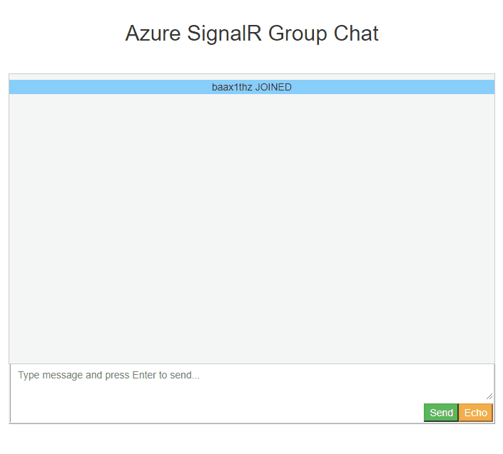
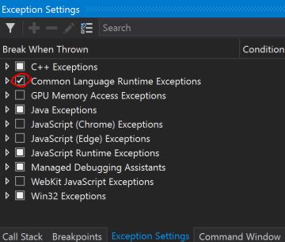

# Troubleshooting Guide

This guidence is to provide useful troubleshooting guide based on the common issues customers encountered and resolved in the past years.

## Access token too long

### Possible errors:

1. Client side `ERR_CONNECTION_`
2. 414 URI Too Long
3. 413 Payload Too Large

### Root cause:
For HTTP/2, the max length for a single header is **4K**, so if you are using browser to access Azure service, you will encounter this limitation with `ERR_CONNECTION_` error.

For HTTP/1.1, or c# clients, the max URI length is **12K**, max header length is **16K**.

With SDK version **1.0.6** or higher, `/negotiate` will throw `413 Payload Too Large` when the generated access token is larger than **4K**.

### Solution:
By default, claims from `context.User.Claims` are included when generating JWT access token to **ASRS**(**A**zure **S**ignal**R** **S**ervice), so that the claims are preserved and can be passed from **ASRS** to the `Hub` when the client connects to the `Hub`.

In some cases, `context.User.Claims` are leveraged to store lots of information for app server, most of which are not used by `Hub`s but by other components. 

The generated access token are passed through network, and for websocket/SSE connections, access tokens are passed through query strings. So as the best practice, we suggest only passing **neccessory** claims from client through **ASRS** to your app server.

There is a `ClaimsProvider` for you to customize the claims passing to **ASRS** inside the access token.

For ASP.NET Core:
```cs
services.AddSignalR()
        .AddAzureSignalR(options =>
            {
                // pick up neccessory claims
                options.ClaimsProvider = context => context.User.Claims.Where(...);
            });
```

For ASP.NET:
```cs
services.MapAzureSignalR(GetType().FullName, options =>
            {
                // pick up neccessory claims
                options.ClaimsProvider = context.Authentication?.User.Claims.Where(...);
            });
```

### Tips:
<a name="view_request"></a>
* How to view the outgoing request from client?
Take ASP.NET Core one for example (ASP.NET one is similar):
    1. From browser:

        Take chrome for example, **F12** to open the console window, and switch to **Network** tab. You might need to refresh the page using **F5** to capture the network from the very beginning.
        
        
    
    2. From C# client:

        You can view local web traffics using [Fiddler](https://www.telerik.com/fiddler). WebSocket traffics are supported since Fiddler 4.5.
        
        

## TLS 1.2 required

### Possible errors:

1. ASP.Net "No server available" error [#279](https://github.com/Azure/azure-signalr/issues/279)
2. ASP.Net "The connection is not active, data cannot be sent to the service." error [#324](https://github.com/Azure/azure-signalr/issues/324)
3. "An error occurred while making the HTTP request to https://<API endpoint>. This could be due to the fact that the server certificate is not configured properly with HTTP.SYS in the HTTPS case. This could also be caused by a mismatch of the security binding between the client and the server."
        
### Root cause:
Azure Service only support TLS1.2 for security concerns. With .NET framework, it is possible that TLS1.2 is not the default protocol. As a result, the server connections to ASRS can not be successfully established.

### Troubleshooting Guide
1. If this error can be repro-ed locally, uncheck *Just My Code* and throw all CLR exceptions and debug the app server locally to see what exception throws.
    * Uncheck *Just My Code*
    
        
    * Throw CLR exceptions
    
        
    * See the exceptions throw when debugging the app server side code:
    
        

2. For ASP.NET ones, you can also add following code to your `Startup.cs` to enable detailed trace and see the errors from the log.
```cs
app.MapAzureSignalR(this.GetType().FullName);
// Make sure this switch is called after MapAzureSignalR
GlobalHost.TraceManager.Switch.Level = SourceLevels.Information;
```

### Solution:

Add following code to your Startup:
```cs
ServicePointManager.SecurityProtocol = SecurityProtocolType.Tls12;
```

## Random 404 returned for client requests

For a SignalR persistent connection, it first `/negotiate` to Azure SignalR service and then establish the real connection to Azure SignalR service. Our load balancer must ensure that the `/negotiate` request and the following connect request goes to the similar instance of the Service otherwise 404 occurs. Our load balancer now relies on the *signature* part of the generated `access_token` to keep the session sticky.

### Troubleshooting Guide
1. Following [How to view outgoing requests](#view_request) to get the request from client the the service.
2. Check if there are multiple `access_token` inside the outgoing request. Our load balancer is not able to handle duplicate `access_token` correctly, as described in [#346](https://github.com/Azure/azure-signalr/issues/346).
3. Another 404 can happen when the connect request is handled more than **5** seconds after `/negotiate` is called. Check the timestamp of client request, and open an issue to us if the request to the service has very slow response.

## 401 Unauthorized returned for client requests
### Root cause
Currently the default value of JWT token's lifetime is 1 hour.

For ASP.NET Core SignalR, when it is using WebSocket transport type, it is OK.

For ASP.NET Core SignalR's other transport type, SSE and longpolling, this means by default the connection can at most persist for 1 hour.

For ASP.NET SignalR, the client sends a `/ping` KeepAlive request to the service from time to time, when the `/ping` fails, the client **aborts** the connection and never reconnect. This means, for ASP.NET SignalR, the default token lifetime makes the connection lasts for **at most** 1 hour for all the transport type.

### Solution

For security concerns, extend TTL is not encouraged. We suggest adding reconnect logic from client to restart the connection when such 401 occurs. When client restarts the connection, it will negotiate with app server to get the JWT token again and get a renewed token.

[Sample code](../samples/) contains restarting connection logic with *ALWAYS RETRY* strategy:

* [ASP.NET Core C# Client](../samples/ChatSample/ChatSample.CSharpClient/Program.cs#L64)

* [ASP.NET Core JavaScript Client](../samples/ChatSample/ChatSample/wwwroot/index.html#L164)

* [ASP.NET Core C# Client](../samples/AspNet.ChatSample/AspNet.ChatSample.CSharpClient/Program.cs#L78)

* [ASP.NET Core JavaScript Client](../samples/AspNet.ChatSample/AspNet.ChatSample.JavaScriptClient/wwwroot/index.html#L71)

## ⌛️[TODO]Client connection drop

When client is connected to the Azure SignalR, the persistent connection between client and Azure SignalR can sometimes drop for different reasons. This section describes several possibilities causing such connection drop, and provide some guidence to how to identify the root cause.

### Possible errors seen from the client side
1. `The remote party closed the WebSocket connection without completing the close handshake`
2. `Service timeout. 30.00ms elapsed without receiving a message from service.`
3. `{"type":7,"error":"Connection closed with an error."}`
4. `{"type":7,"error":"Internal server error."}`

### Root cause:
Client connections can drop under various circumstances:
1. When `Hub` throws exceptions with the incoming request.

2. When the server connection it routed to drops, see below section for details on [server connection drops](#server-conn-drop).

3. When network connectivity issue happens between client and SignalR Service 

4. When SignalR Service has some internal errors such as instance restart, failover..

### Troubleshooting Guide
1. Open app server side log to see if anything abnormal took place
2. Check app server side event log to see if the app server restarted
3. Create an issue to us providing time frame, and email the resource name to us

<a id="server-conn-drop"/>
## ⌛️[TODO]Server side connection drop

When app server starts, in the background, the Azure SDK starts to initiate server connections to the remote Azure SignalR. As described in [Internals of Azure SignalR Service](internal.md), Azure SignalR routes incoming client taffics to these server connections. Once a server connection is dropped, all the client connections it serves will be closed too.

As the connections between app server and SignalR Service are persistent connections, they may experience network connectivity issues. In the Server SDK, we have “Always Reconnect” strategy to server connections. As the best practice, we also encourage users to add continuous reconnect logic to the clients with a random delay time to avoid massive simultaneous requests to the server.

On regular basis there are new version releases for the Azure SignalR Service, and sometimes the Azure wide OS patching or upgrades or occasionally our dependent services’ interruption. These may bring in a very short period of service disruption, but as long as client side has the disconnect/reconnect mechanism, the impact is minimal like any client-side caused disconnect-reconnect.

This section describes several possibilities leading to server connection drop, and provide some guidence to how to identify the root cause.

### Possible errors seen from server side:
1. `[Error]Connection "..." to the service was dropped`
2. `The remote party closed the WebSocket connection without completing the close handshake`
3. `Service timeout. 30.00ms elapsed without receiving a message from service.`

### Root cause:
Server-service connection is closed by **ASRS**(**A**zure **S**ignal**R** **S**ervice).

### Troubleshooting Guide
1. Open app server side log to see if anything abnormal took place
2. Check app server side event log to see if the app server restarted
3. Create an issue to us providing time frame, and email the resource name to us
