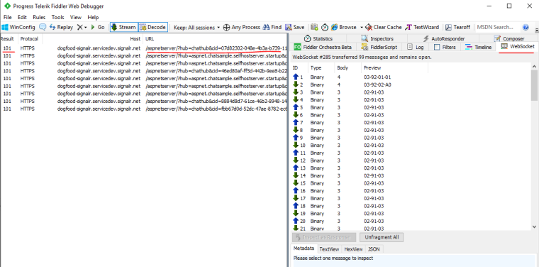

# Troubleshooting Guide

This guidence is to provide useful troubleshooting guide based on the common issues customers encountered and resolved in the past years.

## Access token too long

### Possible errors:

1. Client side `ERR_CONNECTION_`
2. 414 URI Too Long
3. 413 Payload Too Large

### Root cause:
For HTTP/2, the max length for a single header is **4K**, so if you are using browser to access Azure service, you will encounter this limitation with `ERR_CONNECTION_` error.

For HTTP/1.1, or c# clients, the max URI length is **12K**, max header length is **16K**.

With SDK version **1.0.6** or higher, `/negotiate` will throw `413 Payload Too Large` when the generated access token is larger than **4K**.

### Solution:
By default, claims from `context.User.Claims` are included when generating JWT access token to **ASRS**(**A**zure **S**ignal**R** **S**ervice), so that the claims are preserved and can be passed from **ASRS** to the `Hub` when the client connects to the `Hub`.

In some cases, `context.User.Claims` are leveraged to store lots of information for app server, most of which are not used by `Hub`s but by other components. 

The generated access token are passed through network, and for websocket/SSE connections, access tokens are passed through query strings. So as the best practice, we suggest only passing **neccessory** claims from client through **ASRS** to your app server.

There is a `ClaimsProvider` for you to customize the claims passing to **ASRS** inside the access token.

```cs
services.AddSignalR()
        .AddAzureSignalR(options =>
            {
                // pick up neccessory claims
                options.ClaimsProvider = context => context.User.Claims.Where(...);
            });
```

### Tips:
<a name="view_request"></a>
* How to view the outgoing request from client? 
    1. From browser:

        Take chrome for example, **F12** to open the consile window, and switch to **Netork** tab. You might need to refresh the page using **F5** to capture the network from the very beginning.
        
    
    2. From C# client:

        You can view local web traffics using [Fiddler](https://www.telerik.com/fiddler). WebSocket traffics are supported since Fiddler 4.5.
        

## TLS 1.2 required

### Possible errors:

1. ASP.Net "No server available" error [#279](https://github.com/Azure/azure-signalr/issues/279)
2. ASP.Net "The connection is not active, data cannot be sent to the service." error [#324](https://github.com/Azure/azure-signalr/issues/324)
3. "An error occurred while making the HTTP request to https://<API endpoint>. This could be due to the fact that the server certificate is not configured properly with HTTP.SYS in the HTTPS case. This could also be caused by a mismatch of the security binding between the client and the server."
        
### Root cause:
Azure Service only support TLS1.2 for security concerns. With .NET framework, it is possible that TLS1.2 is not the default protocol. As a result, the server connections to ASRS can not be successfully established.

### Troubleshooting Guide
1. If this error can be repro-ed locally, uncheck *Just My Code* and throw all CLR exceptions and debug the app server locally to see what exception throws.
    * Uncheck *Just My Code*
    
    * Throw CLR exceptions
    
    * See the exceptions throw when debugging the app server side code:
    

2. For ASP.NET ones, you can also add following code to your `Startup.cs` to enable detailed trace and see the errors from the log.
```cs
app.MapAzureSignalR(this.GetType().FullName);
// Make sure this switch is called after MapAzureSignalR
GlobalHost.TraceManager.Switch.Level = SourceLevels.Information;
```

### Solution:

Add following code to your Startup:
```cs
ServicePointManager.SecurityProtocol = SecurityProtocolType.Tls12;
```

## Random 404 returned for client requests

For a SignalR persistent connection, it first `/negotiate` to Azure SignalR service and then establish the real connection to Azure SignalR service. Our load balancer must ensure that the `/negotiate` request and the following connect request goes to the similar instance of the Service otherwise 404 occurs. Our load balancer now relies on the *signature* part of the generated `access_token` to keep the session sticky.

### Troubleshooting Guide
1. Following [How to view outgoing requests](#view_request) to get the request from client the the service.
2. Check if there are multiple `access_token` inside the outgoing request. Our load balancer is not able to handle duplicate `access_token` correctly, as described in [#346](https://github.com/Azure/azure-signalr/issues/346).
3. Another 404 can happen when the connect request is handled more than **5** seconds after `/negotiate` is called. Check the timestamp of client request, and open an issue to us if the request to the service has very slow response.

## 403 returned for client requests
### Root cause
Currently the default value of JWT token's lifetime is 1 hour.

For ASP.NET Core SignalR, when it is using WebSocket transport type, it is OK.

For ASP.NET Core SignalR's other transport type, SSE and longpolling, this means by default the connection can at most persist for 1 hour.

For ASP.NET SignalR, the client sends a `/ping` KeepAlive request to the service from time to time, when the `/ping` fails, the client **aborts** the connection and never reconnect. This means, for ASP.NET SignalR, the default token lifetime makes the connection lasts for **at most** 1 hour for all the transport type.

### Workaround

There is a `AccessTokenLifetime` for you to customize the lifetime of the access token.

```cs
services.AddSignalR()
        .AddAzureSignalR(options =>
            {
                // extend the TTL
                options.AccessTokenLifetime = TimeSpan.FromDays(1);
            });
```

## ⌛️[TODO]Client side connection drop

### Possible errors:
1. Client side error log: "The remote party closed the WebSocket connection without completing the close handshake"
2. Client side error log: "Service timeout. 30.00ms elapsed without receiving a message from service."

### Root cause:
Possibility 1. App server restarts
Possibility 2. **ASRS**(**A**zure **S**ignal**R** **S**ervice) internal error

### Troubleshooting Guide
1. Open app server side log to see if anything abnormal took place
2. Check app server side event log to see if the app server restarted
3. Create an issue to us providing time frame, and email the resource name to us

## ⌛️[TODO]Server side connection drop

### Possible errors:
1. Server side error log: "[Error]Connection "..." to the service was dropped"
2. Server side error: "The remote party closed the WebSocket connection without completing the close handshake"

### Root cause:
Server-service connection is closed by **ASRS**(**A**zure **S**ignal**R** **S**ervice).

### Troubleshooting Guide
1. Open app server side log to see if anything abnormal took place
2. Check app server side event log to see if the app server restarted
3. Create an issue to us providing time frame, and email the resource name to us

## ⌛️[TODO]Heartbeat failed

### Possible errors:
1. Server side log: "Service timeout. 30.00ms elapsed without receiving a message from service."
2. Client side error log: "Service timeout. 30.00ms elapsed without receiving a message from service."

### Troubleshooting Guide
1. Open app server side log to see if anything abnormal took place
2. Create server side dump file to see if the app server is thread starving
