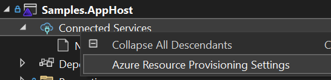
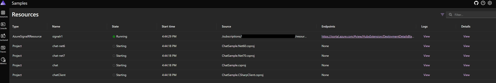

## Example app that makes use of SignalR Client Results

Requires NET7.0 Preview7 or later SDK/Runtime. Please installed from https://dotnet.microsoft.com/en-us/download/dotnet/7.0.

### Usage

[.NET Aspire](https://learn.microsoft.com/dotnet/aspire/get-started/aspire-overview#orchestration) is used to orchestrate the samples.

#### Run with aspire ready in visual studio

To work with .NET Aspire, you need the following installed locally:
- [.NET 8.0](https://dotnet.microsoft.com/download/dotnet/8.0)
- .NET Aspire workload:
  - Installed with the [Visual Studio installer](../fundamentals/setup-tooling.md?tabs=visual-studio#install-net-aspire) or [the .NET CLI workload](../fundamentals/setup-tooling.md?tabs=dotnet-cli#install-net-aspire).
- An OCI compliant container runtime, such as:
  - [Docker Desktop](https://www.docker.com/products/docker-desktop) or [Podman](https://podman.io/).
 
In Visual Studio, set **samples/Samples.AppHost** project as the Startup Project. Right click **Connected Services** and select **Azure Resource Provisioning Settings** and select your Azure subscription, region and resource group to use.



Alternatively, you could add Azure related configurations in the appsettings.json file:
  ```json
  {
    "Azure": {
      "SubscriptionId": "your subscription",
      "Location": "your location"
    }
  }
  ```

Run the project and use Aspire dashboard to navigate to different samples:



#### Run without aspire

Aspire helps you to automatically provision a new Azure SignalR resource and set the connection strings for the sample to use automatically. You could still use the traditional way to set the connection strings by yourself and run the sample directly. Samples now use named connection string `AddNamedAzureSignalR("signalr1")`. Set your connection string to `signalr1:Azure:SignalR:ConnectionString`, or `ConnectionStrings:signalr1`:

```
dotnet user-secrets set Azure:SignalR:signalr1:ConnectionString "<Your connection string>"
dotnet run
```

```
dotnet user-secrets set ConnectionStrings:signalr1 "<Your connection string>"
dotnet run
```

#### Using client results

1. Browse to the site with your favorite browser and it will connect with the SignalR Javascript client.
2. It creates 2 clients by default. Grab an ID from the connected connections and paste it in the ID text box.
3. Press 'Get Message' to invoke a Hub method which will ask the specified ID for a result.
4. The client invoked will unlock 'Ack Message' button and you can type something in the text box above.
5. Press 'Ack Message' to return the message to the server which will return it to the original client that asked for a result.

#### Using broadcast method

1. Browse to the site with your favorite browser and it will connect with the SignalR Javascript client.
2. It creates 2 clients by default.
3. Etner some message in the text box above 'Broadcast'.
4. Press 'Broadcast' to send message to all connected clients.

#### Multiple server cases

1. Run `dotnet run` to start default profile.
2. Run `dotnet run --launch-profile Server1` to start another server.
3. Open default server under `https://localhost:7243`.
4. In any of the iframe update the url to second server's port __7245__, `https://localhost:7245/chats` in this sample to access from second server.
5. Now you're able to test clients on different servers.

#### Using client results from anywhere with `IHubContext`

1. Browse to the site with your favorite browser and it will connect with the SignalR Javascript client.
2. Copy the ID for a connected connection.
3. Navigate to `/get/<ID>` in a new tab. Replace `<ID>` with the copied connection ID.
5. Go to the browser tab for the chosen ID and write a message in the Message text box.
6. Press 'Send Message' to return the message to the server which will return it to the `/get/<ID>` request.
