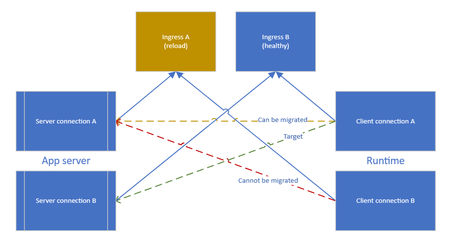
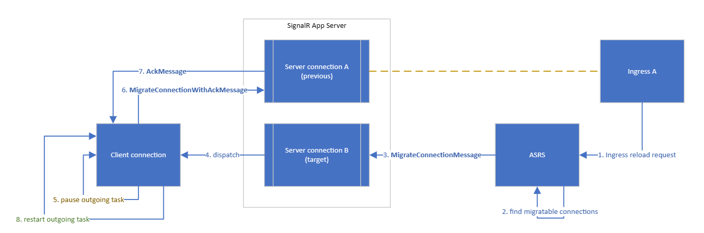

# Connection migration when ingress reload

The feature supports the migration of client connection to another server connection on the same app server whenever feasible, in order to prevent unnecessary disconnections.

## Basic Flow

- Ingress A is being reloaded.
- Client connection A connects to Ingress B.
- Client connection B connects to Ingress A.
- Server connection A connects to Ingress A.
- Server connection B connects to Ingress B.

The disconnection of client connection B and server connection A is inevitable in this scenario.

However, the client connection A will also experience disconnection with our current implementation, as it has a *logical connection* to server connection A.

To avoid this, we could re-route this *logical connection* from server connection A to server connection B.

## Server side implementation

There are 2 async tasks running in the background for a single client connection.

- *Application Task*

  This task processes incoming messages and builds outgoing messages sending to the service connection pipe.

- *Transportation Task*

  This task reads messages from the service connection pipe and dispatch them to the related server connection.

Messages coming from runtime are dispatched to client connection pipes directly, which means we could simply change the service connection reference in our *innerMap*.

However, messages are transmitted via the target server connection may reach earlier than those are transmitted via the previous server connection due to the instability of network.

This happens in both directions.

## Guarantee outgoing message order

To fix that, we would like to implement an Ack mechanism.

### For outgoing messages

We'd like to block messages coming from *ApplicationTask* by pausing the *OutgoingTask*

| Step | Instance          | Description                                                                                      |
| ---- | ----------------- | ------------------------------------------------------------------------------------------------ |
| 1    | Ingress           | Send reload request.                                                                             |
| 2    | ASRS              | Find migratable connections.                                                                     |
| 3    | ASRS              | Send `MigrateConnectionMessage` via the **target** server connection to the app server.          |
| 4    | App server        | The **target** server connection dispatches the message to the client connection to be migrated. |
| 5    | Client connection | Pause _OutgoingTask_, leave _ApplicationTask_ untouched.                                         |
| 6    | Client connection | Send `MigrateConnectionWithAckMessage` to ASRS via the **previous** server connection.           |
| 7    | ASRS | Reply `AckMessage` via the **previous** server connection.                                                                                |
| 8    | Client connection | Restart _OugoingTask_                                                                            |

### For incoming messages

We'd like to buffer messages coming from ASRS until the migration is complete.

| Step | Instance          | Description                                                                                      |
| ---- | ----------------- | ------------------------------------------------------------------------------------------------ |
| 5    | Client connection | Create a temporary pipe to buffer messages coming from the **target** server connections.                                                                             |
| 8    | Client connection | Drain messages from the pipe then delete it. Newer messages will be sent to the client connection pipe directly.                                                                      |

## Runtime side implementation

