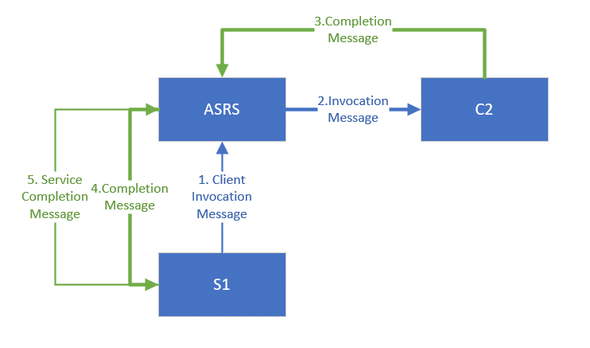
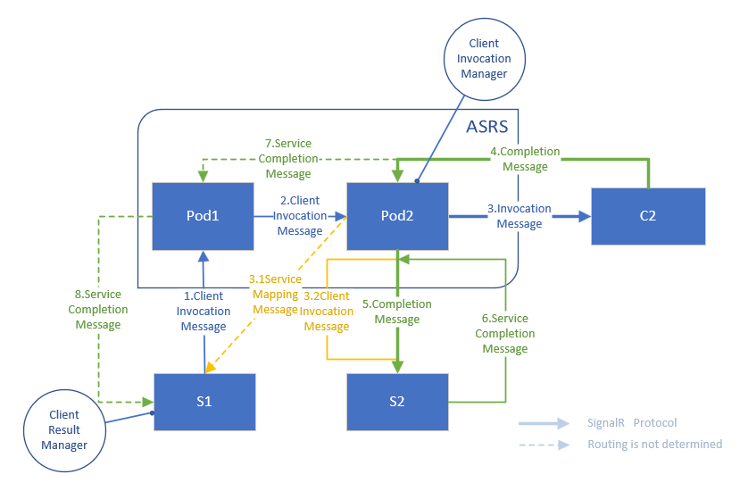
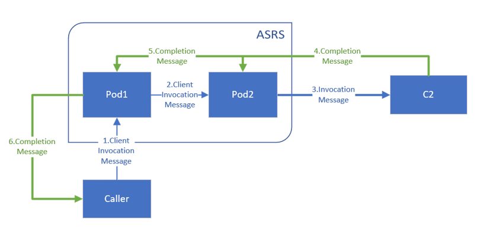

# Client Invocation

## Background
The feature supports server to clients acks to align with the new feature in NET 7.0 of SignalR library. This feature also makes reliable messaging implemented more easily.

Customer faced hub method is same with local SignalR and we'll provide same customer faced API to allow user easily switch between local SignalR and Azure SignalR Service.

```cs
public async Task<string> GetMessage(string ID)
{
    var ressult = await Clients.Client(ID).InvokeAsync<string>("GetMessage", default);
    return $"From {ID}: {ressult}";
}
```

## Basic Flow

### Client is routed to the invoke server



In this case, server is aware of target client status and can easily handle the round trip.

1. (1)(2) Server S1 inits the `ClientInvocation` to service and service forward the message to target client C2.

2. (3)(4) When Client complete the invocation and return `CompletionMessage`, service handle as normal client message and forward to routed server S1 to deserialize. 

3. (5) S1 completes the invocation and return a `ServiceCompletionMessage` to let service do clean-up.

### Client is routed to a different sever



In this case, server is not aware of target client status, and depends on service information to know client status.

1. (1)(2)(3) Server S1 inits the `ClientInvocation` to service and service forward the message to target client C2.

2. (3.1)(3.2) Service instance Pod2 send a `ServiceMappingMessage` to notify original invoker S1 aware of the Pod-Client mapping. In case Pod2 crashes and S1 received a instance offline ping then is able to know C2 is also down.

3. (4)(5) When Client complete the invocation and return `CompletionMessage`, service handle as normal client message and forward to routed server S2 to deserialize. 

4. (6) S2 awares the invocation is not from itself and return a `ServiceCompletionMessage` to let Pod2 forward to correct invoker.

5. (7)(8) Pod2 clean-up local pending invocation and forward the result to original invoker S1.

## Service Procotols

Name|Direction|Usage
--|--|--
ClientInvocationMessage|Server -> Service <br/> Service -> Server|Wrapped `ClientInvocation` <br/> Register the invocation in router server to make it able to handle returns
ClientCompletionMessage|Server -> Service <br/> Server -> Server|Wrapped `CompletionMessage` in __Success__ case to let service cleanups <br/> Notify original invoker server when is global routed
ErrorCompletionMessage|Server -> Service <br/> Server/Service -> Server|Wrapped `CompletionMessage` in __Error__ case to let service cleanups <br/> Notify original invoker server when is global routed
ServiceMappingMessage| Service -> Server | Notify server the client mapping instance, and server would be able to clean-up when it's global routed and service instance reloads or crashes

## * Serverless (NOT Supported in initial version)

Basically the process is similar and the major different is that service understands SignalR protocol and save the round-trip to deserialize to service protocols.

### Persistent Mode



### Transient Mode(TODO)

> NOTES
> 
> * Service cached pending invocations for at most __10 minutes__ for memory concerns and will notify server when timeout.
> * Serverless is __NOT__ supporeted in the first stage.
> * ASPNET SignalR is __NOT__ supported.
> * Sharding is __NOT__ supported. Please use [Geo-Replication](https://learn.microsoft.com/azure/azure-signalr/howto-enable-geo-replication) for combined client invocation and large scale scenarios.